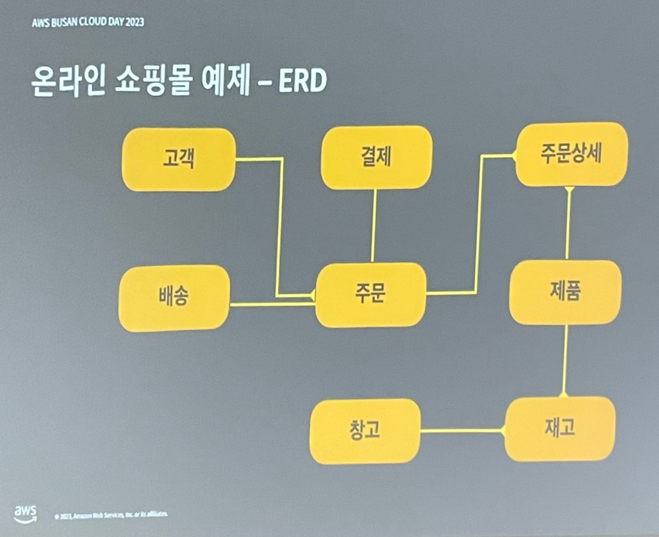
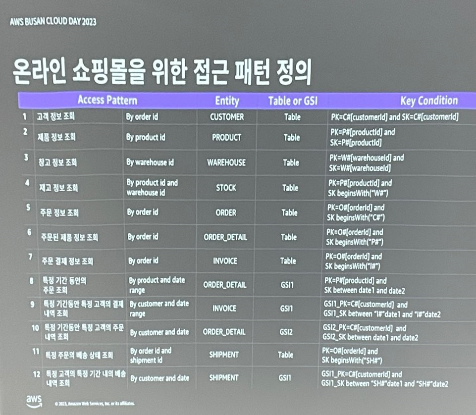

# Amazon DynamoDB

https://aws.amazon.com/ko/dynamodb/


## 다이나모DB 란?

### 작동 방식

- 모든 규모에서 고성능 애플리케이션을 실행하도록 설계된 완전관리형의 서버리스 키-값 NoSQL 데이터베이스입니다.
- 보안, 지속적인 백업, 자동화된 다중 리전 복제, 인 메모리 캐시 및 내보내기 도구를 제공합니다.

### 기능

- 키 값과 문서 데이터 모델을 지원하는 NoSQL 데이터베이스의 일종입니다.
- 우선 작은 규모에서 시작했다가 전역으로 확장하여 초당 페타바이트 단위의 데이터와 수천만 건의 읽기 및 쓰기 요청을 지원합니다.
- 기존 관계형 데이터베이스에서는 역부족인 인터넷 규모의 고성능 애플리케이션을 실행할 수 있도록 설계되었습니다.

### 규모에 따른 성능

- 키-값 및 문서 데이터 모델 : 키-값과 문서 데이터 모델을 모두 지원.
- Accelerator를 사용하여 지연 시간을 마이크로 초 수준으로 최소화 : DynamoDB Accelerator(DAX) 메모리 캐시 지원하여 빠른 읽기.

### 서버리스

- 온디맨드와 프로비저닝의 용량 모드를 제공하여 비용 절약 가능 합니다.

### 엔터프라이즈에 사용 가능

- ACID(**Atomicity**, **Consistency**, **Isolation**, **Durablility**) 트랜잭션 지원 합니다.
- 저장 중 암호화 지원 합니다.
- 특정 시점으로 복구 가능 합니다. (Point-In-Time Recovery)
- 온디맨드 백업 및 복원 가능 합니다.


# 실습 - NoSQL Workbench

- 데이터 모델링, 시각화, 쿼리 개발까지 DynamoDB를 사용할 때 필요한 대부분의 기능을 포함하고 있는 IDE
- 모든 환경에서 사용 가능한 무료 GUI 소프트웨어다.


### Data Modeler

- 새로운 데이터 모델을 손쉽게 생성하거나 Import 할 수 있다.

### Visualization

- 시각화를 통해 별도의 코드 작성 없이 접근 패턴을 정의 할 수 있다.

### Operation builder

- 쿼리를 작성하고 수행해 볼 수 있는 GUI를 제공한다.


## 하나의 테이블만, 복합 기본 키, 추상적인 기본키를 사용하세요!

### 추상적인 기본 키?

- 특별한 의미가 없는 추상적이고 일반적인 이름을 사용하는 것
  - Prefix를 활용한 유연한 데이터 모델링을 통해 여러 엔티티를 하나의 테이블에 저장할 수 있도록 하기 위함이다.
- ex) Partition Key => PK / Sort Key => SK


## 모델링 순서

### 1. ERD

- 관계만 생각하면 된다.
- M:N인 주문 - 제품을 주문상세라는 매핑 테이블 두는 것 정도 생각



### 2. 접근 패턴 생각, 나열



### 3. 기본 키 디자인


[예제](https://github.com/atheanchu/DynamoDBModeling)

``` json
{
  "ModelName": "OnlineShop",
  "ModelMetadata": {
    "Author": "",
    "DateCreated": "Aug 25, 2022, 01:47 PM",
    "DateLastModified": "Oct 04, 2022, 04:05 PM",
    "Description": "",
    "AWSService": "Amazon DynamoDB",
    "Version": "3.0"
  },
  "DataModel": [
    {
      "TableName": "OnlineShop",
      "KeyAttributes": {
        "PartitionKey": {
          "AttributeName": "PK",
          "AttributeType": "S"
        },
        "SortKey": {
          "AttributeName": "SK",
          "AttributeType": "S"
        }
      },
      "NonKeyAttributes": [
        {
          "AttributeName": "Entity",
          "AttributeType": "S"
        },
        {
          "AttributeName": "GSI1_PK",
          "AttributeType": "S"
        },
        {
          "AttributeName": "GSI1_SK",
          "AttributeType": "S"
        },
        {
          "AttributeName": "GSI2_PK",
          "AttributeType": "S"
        },
        {
          "AttributeName": "GSI2_SK",
          "AttributeType": "S"
        },
        {
          "AttributeName": "STATUS",
          "AttributeType": "S"
        },
        {
          "AttributeName": "Email",
          "AttributeType": "S"
        },
        {
          "AttributeName": "Name",
          "AttributeType": "S"
        },
        {
          "AttributeName": "Price",
          "AttributeType": "N"
        },
        {
          "AttributeName": "Detail",
          "AttributeType": "M"
        },
        {
          "AttributeName": "Address",
          "AttributeType": "S"
        },
        {
          "AttributeName": "Quantity",
          "AttributeType": "S"
        },
        {
          "AttributeName": "Date",
          "AttributeType": "S"
        },
        {
          "AttributeName": "Amount",
          "AttributeType": "S"
        }
      ],
      "GlobalSecondaryIndexes": [
        {
          "IndexName": "GSI1",
          "KeyAttributes": {
            "PartitionKey": {
              "AttributeName": "GSI1_PK",
              "AttributeType": "S"
            },
            "SortKey": {
              "AttributeName": "GSI1_SK",
              "AttributeType": "S"
            }
          },
          "Projection": {
            "ProjectionType": "ALL"
          }
        },
        {
          "IndexName": "GSI2",
          "KeyAttributes": {
            "PartitionKey": {
              "AttributeName": "GSI2_PK",
              "AttributeType": "S"
            },
            "SortKey": {
              "AttributeName": "GSI2_SK",
              "AttributeType": "S"
            }
          },
          "Projection": {
            "ProjectionType": "ALL"
          }
        }
      ],
      "TableData": [
        {
          "PK": {
            "S": "C#ironman"
          },
          "SK": {
            "S": "C#ironman"
          },
          "Entity": {
            "S": "CUSTOMER"
          },
          "Email": {
            "S": "ironman@avengers.com"
          },
          "Name": {
            "S": "ironman"
          }
        },
        {
          "PK": {
            "S": "C#hulk"
          },
          "SK": {
            "S": "C#hulk"
          },
          "Entity": {
            "S": "CUSTOMER"
          },
          "Email": {
            "S": "hulk@avengers.com"
          },
          "Name": {
            "S": "hulk"
          }
        },
        {
          "PK": {
            "S": "C#thor"
          },
          "SK": {
            "S": "C#thor"
          },
          "Entity": {
            "S": "CUSTOMER"
          },
          "Email": {
            "S": "thor@avengers.com"
          },
          "Name": {
            "S": "thor"
          }
        },
        {
          "PK": {
            "S": "P#ipad"
          },
          "SK": {
            "S": "P#ipad"
          },
          "Entity": {
            "S": "PRODUCT"
          },
          "Price": {
            "N": "1500"
          },
          "Detail": {
            "M": {
              "Name": {
                "S": "ipad"
              }
            }
          }
        },
        {
          "PK": {
            "S": "P#iphone"
          },
          "SK": {
            "S": "P#iphone"
          },
          "Entity": {
            "S": "PRODUCT"
          },
          "Price": {
            "N": "1000"
          },
          "Detail": {
            "M": {
              "Name": {
                "S": "iphone"
              }
            }
          }
        },
        {
          "PK": {
            "S": "P#mac"
          },
          "SK": {
            "S": "P#mac"
          },
          "Entity": {
            "S": "PRODUCT"
          },
          "Price": {
            "N": "2000"
          },
          "Detail": {
            "M": {
              "Name": {
                "S": "mac"
              }
            }
          }
        },
        {
          "PK": {
            "S": "W#korea"
          },
          "SK": {
            "S": "W#korea"
          },
          "Entity": {
            "S": "WAREHOUSE"
          },
          "Address": {
            "S": "Korea"
          }
        },
        {
          "PK": {
            "S": "W#us"
          },
          "SK": {
            "S": "W#us"
          },
          "Entity": {
            "S": "WAREHOUSE"
          },
          "Address": {
            "S": "US"
          }
        },
        {
          "PK": {
            "S": "P#iphone"
          },
          "SK": {
            "S": "W#korea"
          },
          "Entity": {
            "S": "STOCK"
          },
          "Quantity": {
            "S": "100"
          }
        },
        {
          "PK": {
            "S": "P#iphone"
          },
          "SK": {
            "S": "W#us"
          },
          "Entity": {
            "S": "STOCK"
          },
          "Quantity": {
            "S": "1000"
          }
        },
        {
          "PK": {
            "S": "O#11111"
          },
          "SK": {
            "S": "C#ironman"
          },
          "Entity": {
            "S": "ORDER"
          },
          "Date": {
            "S": "2022-09-22 14:00:00"
          }
        },
        {
          "PK": {
            "S": "O#11111"
          },
          "SK": {
            "S": "P#iphone"
          },
          "Entity": {
            "S": "ORDER_DETAIL"
          },
          "GSI1_PK": {
            "S": "P#iphone"
          },
          "GSI1_SK": {
            "S": "2022-09-22 14:00:00"
          },
          "GSI2_PK": {
            "S": "C#ironman"
          },
          "GSI2_SK": {
            "S": "2022-09-22 14:00:00"
          },
          "Quantity": {
            "S": "2"
          }
        },
        {
          "PK": {
            "S": "O#11111"
          },
          "SK": {
            "S": "P#ipad"
          },
          "Entity": {
            "S": "ORDER_DETAIL"
          },
          "GSI1_PK": {
            "S": "P#ipad"
          },
          "GSI1_SK": {
            "S": "2022-09-22 14:00:00"
          },
          "GSI2_PK": {
            "S": "C#ironman"
          },
          "GSI2_SK": {
            "S": "2022-09-22 14:00:00"
          },
          "Quantity": {
            "S": "1"
          }
        },
        {
          "PK": {
            "S": "O#11111"
          },
          "SK": {
            "S": "I#11111"
          },
          "Entity": {
            "S": "INVOICE"
          },
          "GSI1_PK": {
            "S": "C#ironman"
          },
          "GSI1_SK": {
            "S": "I#2022-09-22 14:00:00"
          },
          "Amount": {
            "S": "3500"
          }
        },
        {
          "PK": {
            "S": "O#22222"
          },
          "SK": {
            "S": "C#ironman"
          },
          "Entity": {
            "S": "ORDER"
          },
          "Date": {
            "S": "2022-09-22 20:00:00"
          }
        },
        {
          "PK": {
            "S": "O#22222"
          },
          "SK": {
            "S": "P#mac"
          },
          "Entity": {
            "S": "ORDER_DETAIL"
          },
          "GSI1_PK": {
            "S": "P#mac"
          },
          "GSI1_SK": {
            "S": "2022-09-22 20:00:00"
          },
          "GSI2_PK": {
            "S": "C#ironman"
          },
          "GSI2_SK": {
            "S": "2022-09-22 20:00:00"
          },
          "Quantity": {
            "S": "1"
          }
        },
        {
          "PK": {
            "S": "O#22222"
          },
          "SK": {
            "S": "I#22222"
          },
          "Entity": {
            "S": "INVOICE"
          },
          "GSI1_PK": {
            "S": "C#ironman"
          },
          "GSI1_SK": {
            "S": "I#2022-09-22 20:00:00"
          },
          "Amount": {
            "S": "2000"
          }
        },
        {
          "PK": {
            "S": "O#11111"
          },
          "SK": {
            "S": "SH#11111"
          },
          "Entity": {
            "S": "SHIPMENT"
          },
          "GSI1_PK": {
            "S": "C#ironman"
          },
          "GSI1_SK": {
            "S": "SH#2022-09-23 14:00:00"
          },
          "STATUS": {
            "S": "Complete"
          }
        },
        {
          "PK": {
            "S": "O#22222"
          },
          "SK": {
            "S": "SH#22222"
          },
          "Entity": {
            "S": "SHIPMENT"
          },
          "GSI1_PK": {
            "S": "C#ironman"
          },
          "GSI1_SK": {
            "S": "SH#2022-09-30 08:00:00"
          },
          "STATUS": {
            "S": "Complete"
          }
        }
      ],
      "DataAccess": {
        "MySql": {}
      },
      "BillingMode": "PROVISIONED",
      "ProvisionedCapacitySettings": {
        "ProvisionedThroughput": {
          "ReadCapacityUnits": 5,
          "WriteCapacityUnits": 5
        },
        "AutoScalingRead": {
          "ScalableTargetRequest": {
            "MinCapacity": 1,
            "MaxCapacity": 10,
            "ServiceRole": "AWSServiceRoleForApplicationAutoScaling_DynamoDBTable"
          },
          "ScalingPolicyConfiguration": {
            "TargetValue": 70
          }
        },
        "AutoScalingWrite": {
          "ScalableTargetRequest": {
            "MinCapacity": 1,
            "MaxCapacity": 10,
            "ServiceRole": "AWSServiceRoleForApplicationAutoScaling_DynamoDBTable"
          },
          "ScalingPolicyConfiguration": {
            "TargetValue": 70
          }
        }
      }
    }
  ]
}
```


출처: AWS Cloud day in Busan 강연 중

