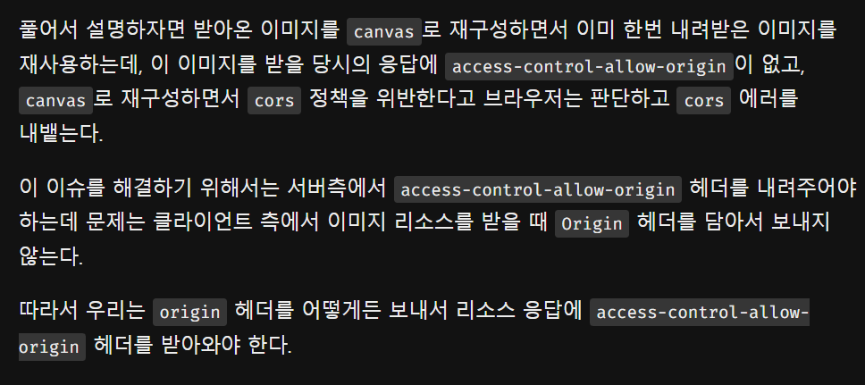
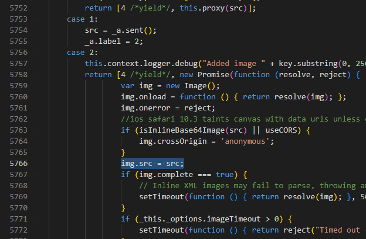
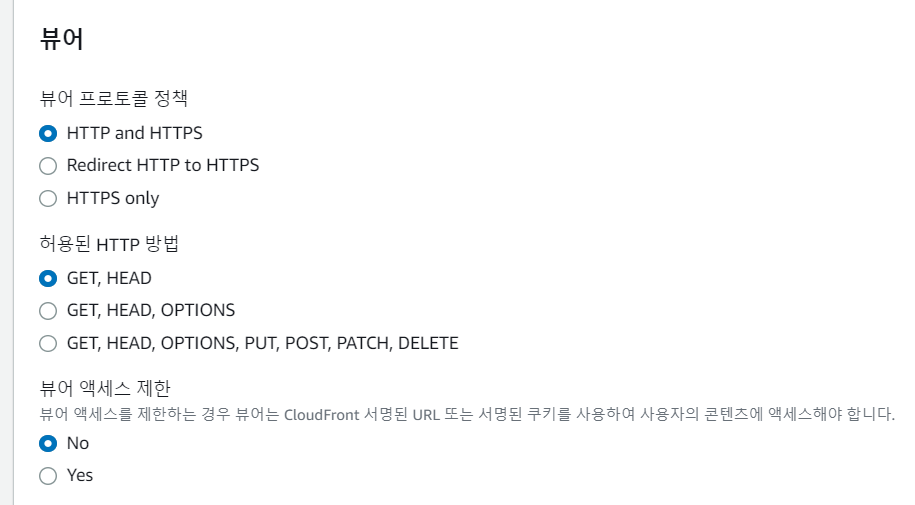
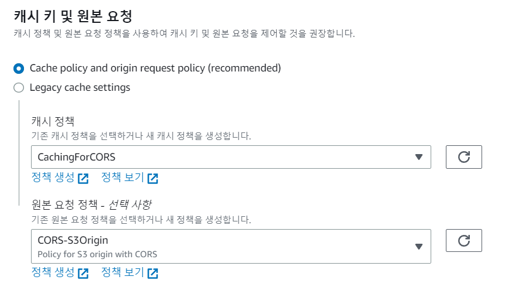
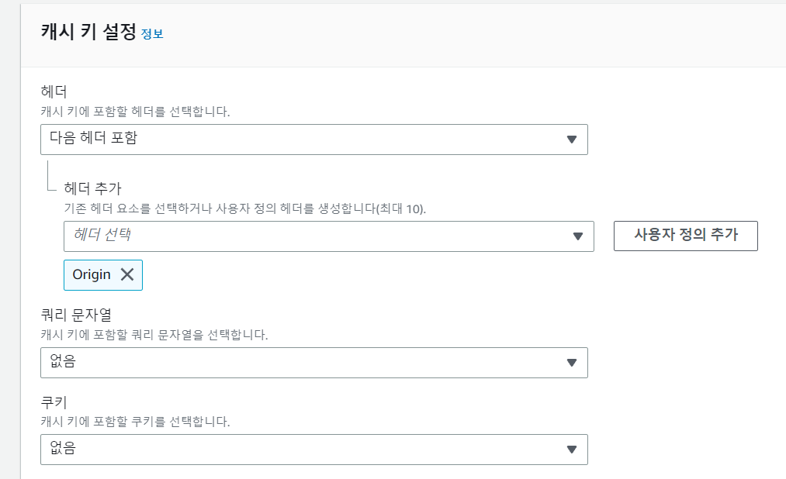

## html2canvas img가 url 일 때 썸네일 생성안되는 오류

- 계속 s3 url이 src인 이미지만 썸네일에 포함 안되는 오류가 있었다

` html2canvas(imageArea, { useCORS: true }).then(canvas => {` 추가하고

` img.crossOrigin = 'anonymous';` 추가!

``` js
 canvas() {
      try {
        const imageArea = this.$refs.dragImage;
        html2canvas(imageArea, { useCORS: true }).then(canvas => {
          const ctx = canvas.getContext('2d');
          const img = new Image();
          img.crossOrigin = 'anonymous'; // CORS 허용
          img.onload = () => {
            // 이미지의 원본 크기 가져오기
            const originalWidth = img.width;
            const originalHeight = img.height;

            // 이미지 크기 축소 비율
            const reductionRatio = 0.35; // 30%로 축소

            // 축소된 이미지 크기 계산
            const reducedWidth = originalWidth * reductionRatio;
            const reducedHeight = originalHeight * reductionRatio;

            // 축소된 이미지 그리기
            canvas.width = reducedWidth;
            canvas.height = reducedHeight;
            ctx.drawImage(img, 0, 0, reducedWidth, reducedHeight);

            // 데이터 URL 생성
            const dataUrl = canvas.toDataURL('image/jpeg', 0.35); // JPEG 포맷, 압축률 70%
            this.currentPageList.thumbnail = dataUrl;
          }

          img.src = canvas.toDataURL();
        });
      }
      catch (err) {
        console.log(err);
      }
    },
```


## html2canvas  S3 url CORS 뜰 때

- 분명히 S3 bucket에도 버킷 정책, CORS 정책이 추가되어있는데 자꾸 CORS 오류 뜨는 상황이였다.


### 버킷 정책

```
{
    "Version": "2012-10-17",
    "Id": "Policy1683173940257",
    "Statement": [
        {
            "Sid": "Stmt1683173938059",
            "Effect": "Allow",
            "Principal": "*",
            "Action": [
                "s3:GetObject",
                "s3:PutObject"
            ],
            "Resource": "arn:aws:s3:::taleteller/*"
        }
    ]
}
```


### CORS 정책

```
[
    {
        "AllowedHeaders": [
            "*"
        ],
        "AllowedMethods": [
            "HEAD",
            "GET",
            "PUT",
            "POST"
        ],
        "AllowedOrigins": [
            "*"
        ],
        "ExposeHeaders": []
    }
]
```


같은 이슈를 겪고 있는 블로그를 찾았다. ㅠ

https://velog.io/@kimsehwan96/S3-CORS-%ED%97%A4%EB%8D%94-%EA%B4%80%EB%A0%A8-%EC%9D%B4%EC%8A%88-%ED%95%B4%EA%B2%B0%EB%B0%A9%EB%B2%95-html2canvas-lottie

CORS 정책을 정의했다고 해서 `html2canvas`나 혹은 `lottie`와 같은 것들을 바로 사용 가능한 상태는 아니다.

S3버킷은 `access-control-allow-origin` 헤더를 특정 상황에서만 반환하는데..

클라이언트의 리소스 요청(request)에 `Origin` 헤더가 있어야만 `access-control-allow-origin` 헤더를 내려보내준다!



위 블로그는 **Cloud Front** 로 이슈를 해결하였다.

댓글을 보니 트릭을 주는 방법도 있는 것 같아서 더 찾아보았다!


## 1. html2canvas.js 코드 수정

동일한 객체가 아닌걸로 하게끔 트릭 주는 법 - [블로그 참고](https://www.programmersought.com/article/21917434935/)

node_modules 폴더 안에 html2canvas -> 5766번째줄 변경



```
img.src = /^data:image/.test(src) ? src : src + '?' + new Date().getTime();
```

- 이렇게 수정하고 나니 해결은 되었지만 node_modules 는 gitignore 라 올라가지 않아서 새로 받을 때 마다 수정해줘야했다.
- 그래서 CloudFront 를 이용해 해결했다.


## 2. CloudFront 를 이용한 이슈 해결

`CloudFront > 배포 > 만들어둔 것 클릭 > 동작 > 동작 편집`





### 캐시 정책

` 정책 생성 > 이름 입력 > 캐시 키 설정`




[참고블로그1](https://velog.io/@leehaeun0/%EB%AF%B8%EB%94%94%EC%96%B4%ED%8C%8C%EC%9D%BC-S3%EC%97%90%EC%84%9C-CloudFront%EB%A1%9C-%EC%9D%B4%EC%82%AC%ED%95%98%EA%B8%B0-feat-CORS)

[참고블로그2](https://bigboss.dev/2021/11/cloudfront-settings-to-use-s3-cors/)


## 추가) 이미지 src가 S3 url 일 경우 생기는 CORS

### [crossorigin="anonymous"](https://gmyankee.tistory.com/270)

```
" crossorigin="anonymous">
```

위 처럼 crossorigin 즉 동일출처정책에 대해서 익명으로 접근하겠다고 명시하면  해결된다.

아래와 같이 코드 수정 후 CORS 이슈 해결!

```vue
<div class="uploaded-image-list" v-show="selectedMenu == 'character'">
   
</div>
<div class="uploaded-image-list" v-show="selectedMenu == 'background'">
    
</div>
```


## [crossorigin](https://developer.mozilla.org/en-US/docs/Web/HTML/Element/img#crossorigin)?

`crossorigin`은 이미지를 가져오는 데 CORS(Cross-Origin Resource Sharing) 요청을 사용해야 하는지 여부를 나타내는 속성입니다. CORS 요청을 통해 반환된 CORS 활성화된 이미지의 이미지 데이터는 "tainted"로 표시되지 않고 <canvas> 요소에서 재사용할 수 있습니다.

`crossorigin` 속성이 지정되지 않으면, CORS 요청 없이 (Origin 요청 헤더 없이) 비-CORS 요청이 전송되며, 브라우저는 이미지를 "tainted"로 표시하고 이미지 데이터에 대한 액세스를 제한하여 <canvas> 요소에서 사용을 방지합니다.

`crossorigin` 속성이 지정되면, CORS 요청이 전송되고 (Origin 요청 헤더와 함께), 그러나 서버가 원본 사이트의 이미지 데이터에 대한 교차 출처 액세스를 허용하지 않도록 설정하지 않는 한(접근 제어 허용-Origin 응답 헤더를 보내지 않거나, 보낸 응답 헤더에 사이트의 원본을 포함시키지 않음), 브라우저는 이미지 로딩을 차단하고 CORS 오류를 개발자 도구 콘솔에 기록합니다.

- `anonymous`: 자격증명이 생략된 상태로 CORS 요청이 전송됩니다. (쿠키, X.509 인증서, Authorization 요청 헤더 없음)


