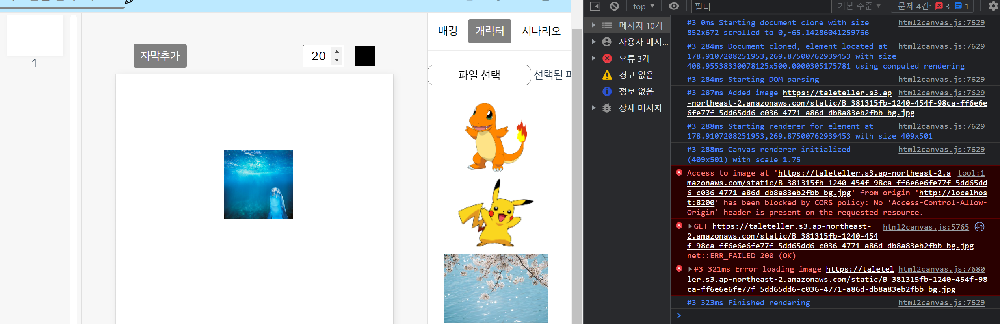
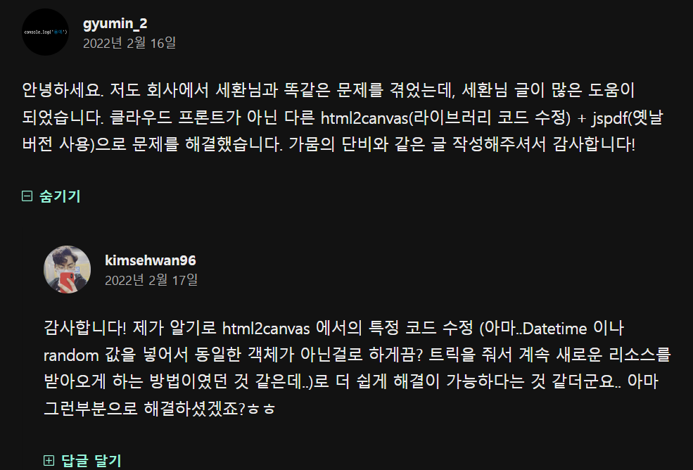
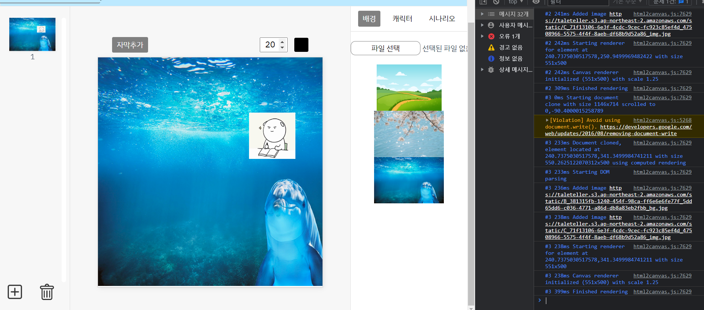

## html2canvas img가 url 일 때 썸네일 생성안되는 오류

- 오류 문구는 뜨지 않고 계속 해당 이미지만 썸네일에 포함 안되는 오류가 있었음.

` html2canvas(imageArea, { useCORS: true }).then(canvas => {` 추가하고

` img.crossOrigin = 'anonymous';` 추가!

``` js
 canvas() {
      try {
        const imageArea = this.$refs.dragImage;
        html2canvas(imageArea, { useCORS: true }).then(canvas => {
          const ctx = canvas.getContext('2d');
          const img = new Image();
          img.crossOrigin = 'anonymous'; // CORS 허용
          img.onload = () => {
            // 이미지의 원본 크기 가져오기
            const originalWidth = img.width;
            const originalHeight = img.height;

            // 이미지 크기 축소 비율
            const reductionRatio = 0.35; // 30%로 축소

            // 축소된 이미지 크기 계산
            const reducedWidth = originalWidth * reductionRatio;
            const reducedHeight = originalHeight * reductionRatio;

            // 축소된 이미지 그리기
            canvas.width = reducedWidth;
            canvas.height = reducedHeight;
            ctx.drawImage(img, 0, 0, reducedWidth, reducedHeight);

            // 데이터 URL 생성
            const dataUrl = canvas.toDataURL('image/jpeg', 0.35); // JPEG 포맷, 압축률 70%
            this.currentPageList.thumbnail = dataUrl;
          }

          img.src = canvas.toDataURL();
        });
      }
      catch (err) {
        console.log(err);
      }
    },
```


## html2canvas  S3 url CORS 뜰 때



- 분명히 S3 bucket에도 버킷 정책, CORS 정책이 추가되어있는데 자꾸 CORS 오류 뜨는 상황..

### 버킷 정책

```
{
    "Version": "2012-10-17",
    "Id": "Policy1683173940257",
    "Statement": [
        {
            "Sid": "Stmt1683173938059",
            "Effect": "Allow",
            "Principal": "*",
            "Action": [
                "s3:GetObject",
                "s3:PutObject"
            ],
            "Resource": "arn:aws:s3:::taleteller/*"
        }
    ]
}
```


### CORS

```
[
    {
        "AllowedHeaders": [
            "*"
        ],
        "AllowedMethods": [
            "HEAD",
            "GET",
            "PUT",
            "POST"
        ],
        "AllowedOrigins": [
            "*"
        ],
        "ExposeHeaders": []
    }
]
```


같은 이슈를 겪고 있는 블로그를 찾았다.

https://velog.io/@kimsehwan96/S3-CORS-%ED%97%A4%EB%8D%94-%EA%B4%80%EB%A0%A8-%EC%9D%B4%EC%8A%88-%ED%95%B4%EA%B2%B0%EB%B0%A9%EB%B2%95-html2canvas-lottie

CORS 정책을 정의했다고 해서 `html2canvas`나 혹은 `lottie`와 같은 것들을 바로 사용 가능한 상태는 아니다.

S3버킷은 `access-control-allow-origin` 헤더를 특정 상황에서만 반환하는데..

클라이언트의 리소스 요청(request)에 `Origin` 헤더가 있어야만 `access-control-allow-origin` 헤더를 내려보내준다!


위 블로그는 **Cloud Front** 로 이슈를 해결하였다.

Cloud Front에 대한 자세한 포스팅 - https://earth-95.tistory.com/128

그리고 댓글을 보니 트릭을 주는 방법도 있는 것 같다.



동일한 객체가 아닌걸로 하게끔 트릭 주는 법 - https://www.programmersought.com/article/21917434935/

node_modules 폴더 안에 html2canvas -> 5766번째줄 변경


```
img.src = /^data:image/.test(src) ? src : src + '?' + new Date().getTime();
```


결과는 .. !!! 성공!!!!!!!!!!!!!!!!!!!

