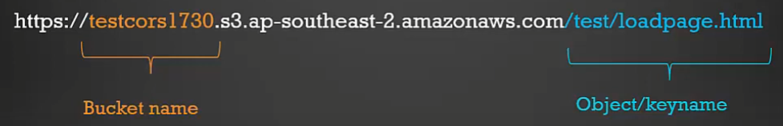
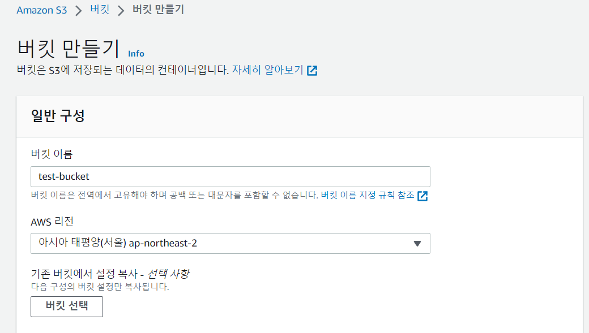
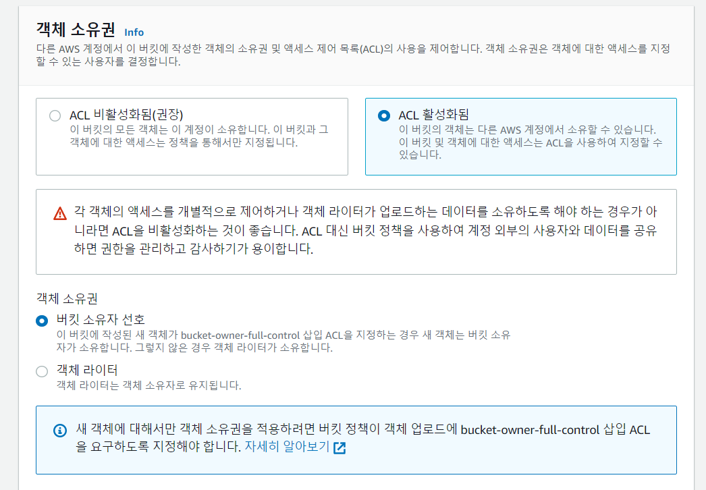
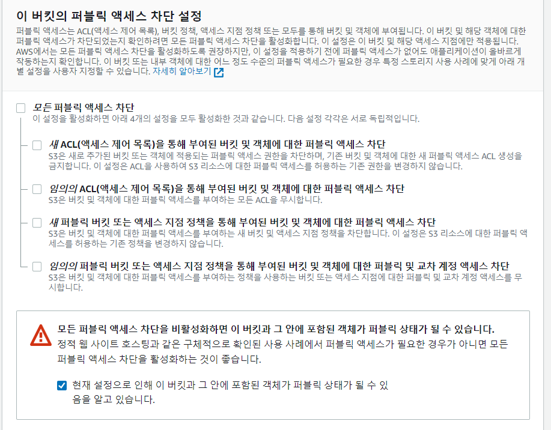
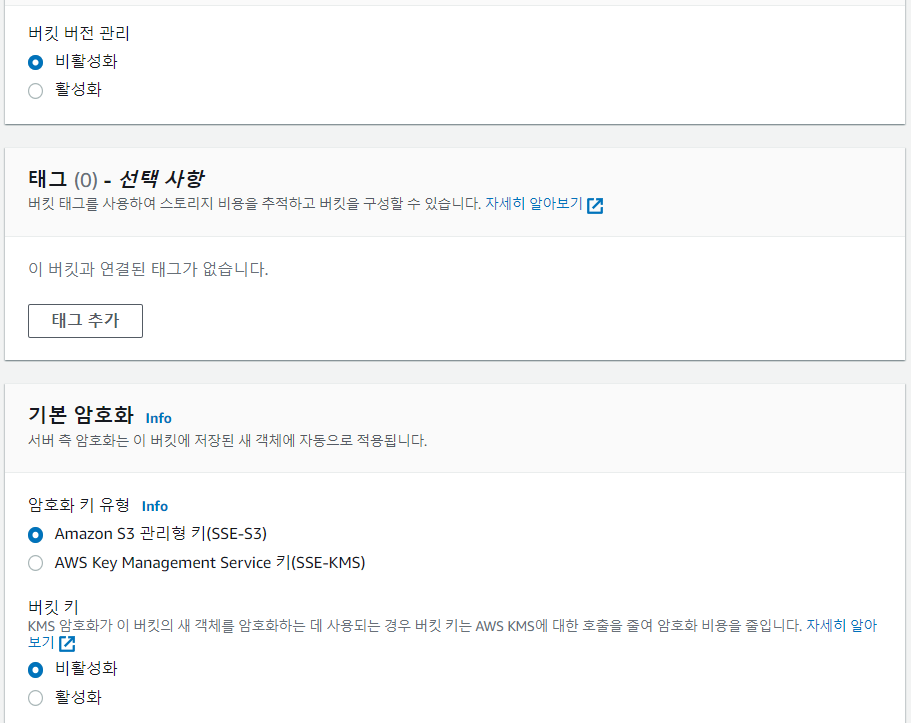
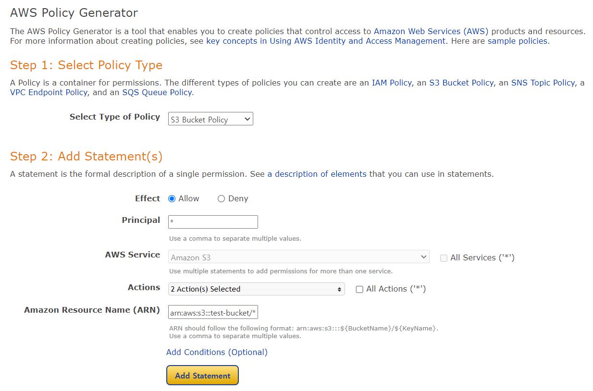
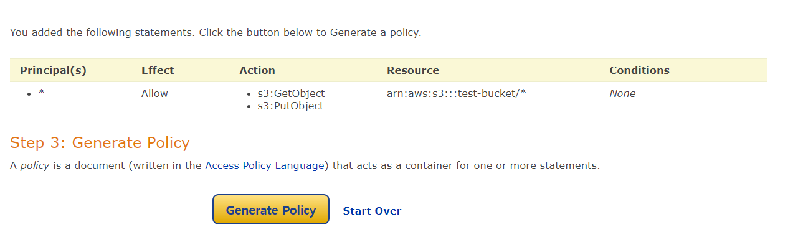
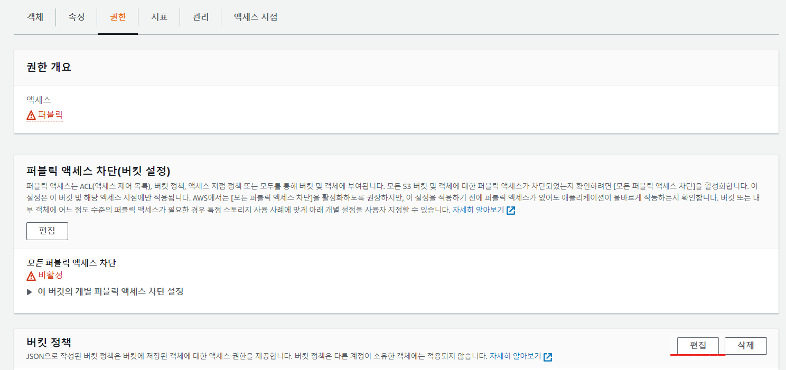
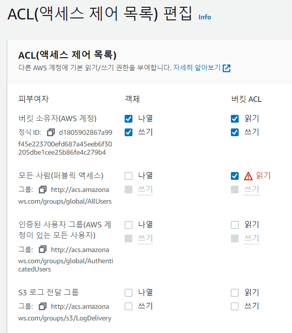

### **S3 (Simple Storage Service)**

AWS S3는 업계 최고의 확장성과 데이터 가용성 및 보안과 성능을 제공하는 **온라인 오브젝트(객체) 스토리지 서비스**이다.

쉽게 말하자면, 스토리지 즉 구글 드라이브 처럼 파일 저장 서비스이며, **데이터를** **온라인으로** **오브젝트**형태로 저장하는 서비스라고 보면 된다.

#### **S3을 사용하는 이유**

-   S3는 저장 용량이 무한대이고 파일 저장에 최적화되어 있다. 용량을 추가하거나 성능을 높이는 작업이 필요없다.
-   비용은 EC2와 EBS로 구축하는 것보다 훨씬 저렴하다
-   S3 자체가 수천 대 이상의 매우 성능이 좋은 웹 서버로 구성되어 있어서 EC2와 EBS로 구축했을 때 처럼 Auto Scaling이나 Load Balancing에 신경쓰지 않아도 된다.
-   웹하드 서비스와 비슷하지만, 별도의 클라이언트 설치나 ActiveX를 통하지 않고, HTTP 프로토콜(restful)로 파일 업로드/다운로드 처리가 가능하다.
-   S3 자체로 정적 웹서비스 가능 (html 파일을 스토리지에 저장하고, html 파일에 접근하면 그게 홈페이지)
-   동적 웹페이지와 정적 웹페이지가 섞여있을 때 동적 웹페이지만 EC2에서 서비스하고 정적 웹페이지는 S3를 이용하면 성능도 높이고 비용도 절감할 수 있다.

### **S3 버킷 / 객체 개념**

-   객체(Object)는 데이터와 메타데이터를 구성하고 있는 저장 단위이며
-   버킷(Bucket)은 이러한 객체를 저장하고 관리하는 역할을 한다.

S3을 구성할때, **버킷(Bucket)**이라는 컨테이너를 놓을 **리전을 선택**하고, 해당 컨테이너 내부에 **객체(Object)**라는 형태로 데이터를 저장하는 형태로 스토리지를 구축한다.

한 계정 당 Bucket은 최대 100개까지 사용이 가능하고, 버킷 단위로 접근 제한을 설정할 수도 있다.

단, Bucket의 소유권은 이전할 수 없기 때문에 주의해야 한다.

#### **주소의 형태**



---

### **버킷 만들기**

먼저, S3 권한이 있는 IAM 계정으로 로그인 하여 Amazon S3에 들어간다.

버킷 만들기를 클릭하고 진행




 






-   이 버킷의 퍼블릭 액세스를 차단한다는 것은 외부에서도 파일을 읽게 하지 못한다는 의미
-   저는 밖에서 읽고 업로드도 할 예정이라 해제해주었음



버킷 버전 관리기능을 활성화하면 파일을 버전별로 관리해서 비용이 더 들게 된다.

하지만 실수로 삭제해도 복원이 가능하다.

암호화를 활성화하게되면 버킷의 모든 새 객체에 암호화해서 저장한다.


### **버킷 정책 설정하기**

아래 사이트에서 버킷 정책을 쉽게 생성할 수 있다.

[http://awspolicygen.s3.amazonaws.com/policygen.html](http://awspolicygen.s3.amazonaws.com/policygen.html)



-   Principal : 버킷 정책이 적용될 대상 ( 전체는 \* )
-   Actions : 버킷에 수행할 액션을 선택한다. (GetObject, PutObject)
-   ARN : 버킷에 어떤 리소스 적용할지 ( arn:aws:s3:::버킷이름/\* )

Add Statement 클릭 후



해당 내용을 복사한다.

```
{
  "Id": "Policy1684746160824",
  "Version": "2012-10-17",
  "Statement": [
    {
      "Sid": "Stmt1684746139445",
      "Action": [
        "s3:GetObject",
        "s3:PutObject"
      ],
      "Effect": "Allow",
      "Resource": "arn:aws:s3:::test-bucket/*",
      "Principal": "*"
    }
  ]
}
```

해당 버킷 클릭 - 권한 - 버킷 정책에 편집 클릭 후 붙여넣기





### **CORS 정책 추가**

```
[
    {
        "AllowedHeaders": [
            "*"
        ],
        "AllowedMethods": [
            "GET",
            "PUT",
            "POST"
        ],
        "AllowedOrigins": [
            "*"
        ],
        "ExposeHeaders": []
    }
]
```

이렇게 하면 프로젝트에 쓸 기본 설정이 끝났다. ~~ !

이제 프로젝트에서 버킷으로 파일들을 업로드 해보자

[참고 블로그](https://inpa.tistory.com/entry/AWS-%F0%9F%93%9A-S3-%EB%B2%84%ED%82%B7-%EC%83%9D%EC%84%B1-%EC%82%AC%EC%9A%A9%EB%B2%95-%EC%8B%A4%EC%A0%84-%EA%B5%AC%EC%B6%95#s3%EC%9D%84_%EC%82%AC%EC%9A%A9%ED%95%98%EB%8A%94_%EC%9D%B4%EC%9C%A0)