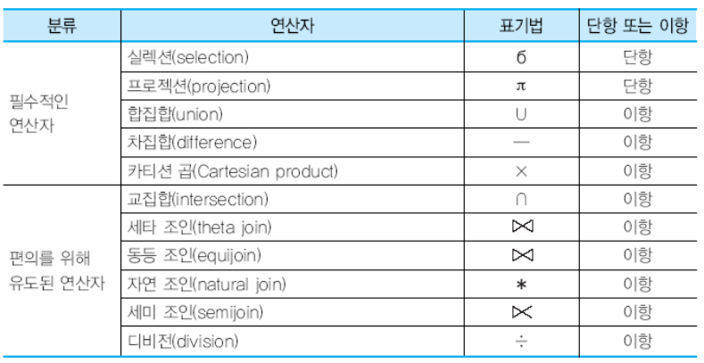
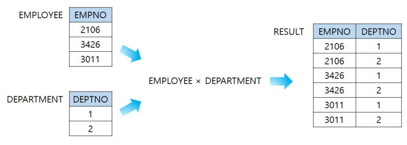
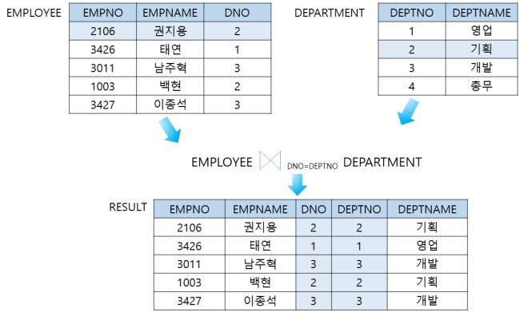
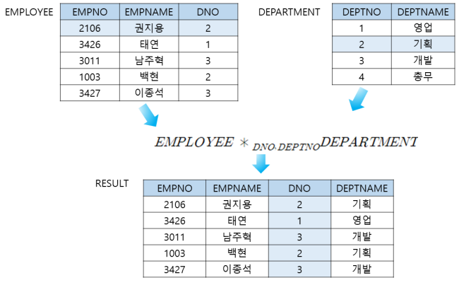

[toc]

# 관계 대수와 SQL

- 관계 해석 : 질의를 어떻게 수행할 것인가는 명시하지 않는 선언적인 언어
- 관계 대수 : 어떻게 질의를 수행할 것인가를 명시하는 절차적 언어

## 관계 대수

- 기존의 릴레이션들로부터 새로운 릴레이션을 생성함 

  ex) 교집합, 합집합 등 - 표기법 암기할 것

  

  

### Selection 연산자

- **셀렉션 조건(=predicate) 을 만족하는 투플들의 부분 집합을 생성**함
- 단항 연산자
- 결과 릴레이션의 차수는 입력 릴레이션의 차수(열의 개수)와 같음 
- 결과 릴레이션의 카디날리티(행의 개수)는 항상 원래 릴레이션의 카디날리티보다 작거나 같음

### Projection 연산자

- 한 릴레이션의 애트리뷰트들의 부분 집합을 구함
- 중복된 투플 존재할 수 있음(셀렉션은 중복 투플 존재X)

### Union 연산자

- 두 릴레이션 R과 S의 합집합 R ∪ S는 R 또는 S에 있거나 R과 S 모두에 속 한 투플들로 이루어진 릴레이션
- 결과 릴레이션에서 중복된 투플들은 제외

### Intersection 연산자

- 두 릴레이션 R과 S의 교집합 R ∩ S는 R과 S 모두에 속한 투플들로 이루어진 릴레이션

### difference 연산자

- 두 릴레이션 R과 S의 차집합 R - S는 R에는 속하지만 S에는 속하지 않은 투플들로 이루어진 릴레이션

### Cartesian product(카디션 곱) 연산자

- 카디날리티가 i인 릴레이션 R(A1, A2, ..., An)과 카디날리티가 j인 릴레이션 S(B1, B2, ..., Bm)의 

  카티션 곱 R × S는**차수가 n+m, 카디날리티가 i*j **인 애트리뷰트가 

  (A1, A2, ..., An, B1, B2, ..., Bm)이며, R과 S의 투 플들의 모든 가능한 조합으로 이루어진 릴레이션

### 세타 조인(theta join) 과 동등 조인

- 세타는 ( =, <>, <=, <, >=, > ) 중의 하나

- 두 릴레이션 R(A1, A2, ..., An)과 S(B1, B2, ..., Bm)의 세타 조인의 결과는 차수가 n+m이고, 

  애트리뷰트가 (A1, A2, ..., An, B1, B2, ..., Bm)이며, 조 인 조건을 만족하는 투플들로 이루어진 릴레이션

- 동등 조인은 세타 조인 중 비교 연산자가 = 인 조인

### 자연 조인

- 동등 조인의 결과 릴레이션에서 조인 애트리뷰트를 제외한 조인
- DNO 와 DEPTNO 는 같으니까 DEPTNO 제외 

### Division 연산자

- 차수가 n+m인 릴레이션 R(A1, A2, ..., An, B1, B2, ..., Bm)과 차수가 m인 릴레이션 S(B1, B2, ..., Bm)의 디비전 R ÷ S는

  차수가 n이고, S에 속하는 모든 투플 u에 대하여 투플 tu(투플 t와 투플 u을 결합한 것)가 R에 존재하 는 투플 t들의 집합

## 관계 대수의 한계

- 관계 대수는 산술 연산을 할 수 없음
- 집단 함수(aggregate function)를 지원하지 않음 
- 정렬을 나타낼 수 없음
- 데이터베이스를 수정할 수 없음 
- 프로젝션 연산의 결과에 중복된 투플을 나타내는 것이 필요할 때가 있는데 이를 명시하지 못함

