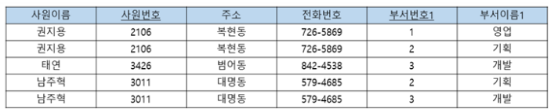
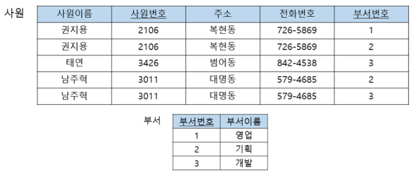
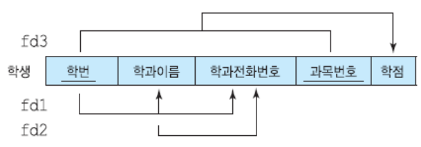
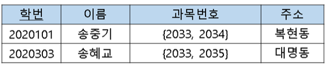
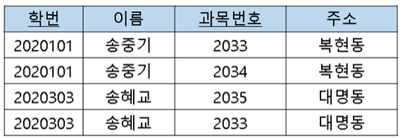
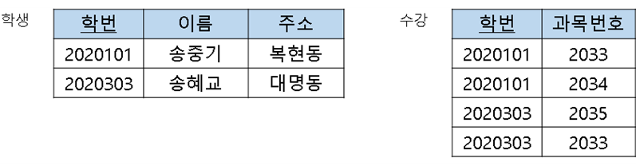
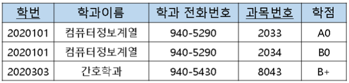
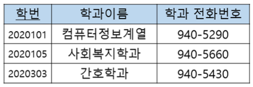
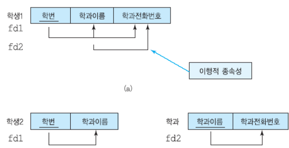
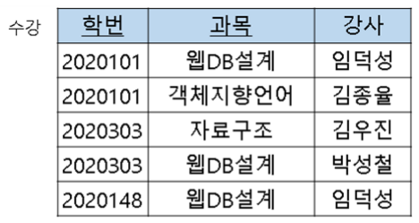

[toc]

# 릴레이션 정규화

### 정규화를 시키는 이유?

- 데이터베이스 설계를 잘 못하면 데이터 중복 야기 - 갱신 이상

- 중복을 최소화 하는 방법으로 정규화를 사용

## 📌 정규화

- 정규화(normalization)는 주어진 릴레이션 스키마를 **함수적 종속성과 기본 키를 기반**으로 분석하여, 원래의 릴레이션을 분해함으로써 중복과 세 가지 갱신 이상을 최소화함
- 즉, 원래의 릴레이션을 분해 -> 중복을 줄이는 것

### 갱신 이상(update anomaly)

- 수정 이상(modification anomaly) 
	- 반복된 데이터 중에 일부만 수정하면 데이터의 불일치가 발생 
	
	  ex) 어떤 부서의 이름이 바뀔 때 이 부서에 근무하는 일부 사원 투플에서만 부서 이름을 변경하면 데이터베이스가 불일치 상태
	
	- 데이터를 한 개 수정하니 데이터의 일관성이 깨짐
	
- 삽입 이상(insertion anomaly) 
	- 불필요한 정보를 함께 저장하지 않고는 어떤 정보를 저장하는 것이 불가능
	
	  ex) 어떤 부서를 신설했는데 아직 사원을 한 명도 배정하지 않았다면 이 부서에 관한 정보를 입력할 수 없음
	
	- 기본키에 null - 엔티티 무결성 제약 조건 위배
	
- 삭제 이상(deletion anomaly) 
	- 유용한 정보를 함께 삭제하지 않고는 어떤 정보를 삭제하는 것이 불가
	
	  ex) 어떤 부서에 속한 사원이 단 한 명이 있는데, 이 사원에 관한 투플을 삭제 하면 이 사원이 속한 부서에 관한 정보도 릴레이션에서 삭제됨
	
- 정보의 중복 
  - 각 사원이 속한 부서 수만큼 동일한 사원의 투플들이 존재하므로 사원이름, 사원번호, 주소, 전화번호 등이 중복되어 저장 공간이 낭비됨
  
  

### 릴레이션 분해

- 하나의 릴레이션을 두 개 이상의 릴레이션으로 나누는 것

##  📌정규형의 종류

- 제1정규형(first normal form), 제2정규형(second normal form), 제3정규형(third normal form), BCNF(Boyce-Codd normal form)
- 제4정규형(fourth normal form), 제5정규형(fifth normal form)

### 결정자(determinant)

- 어떤 애트리뷰트 값은 다른 애트리뷰트의 값을 고유하게 결정할 수 있음
- **사원번호(결정자)**는 사원이름을 **고유하게 결정**함 (= 사원번호를 주면 사원이름을 알 수 있다)
- 두 개이상 있는 값은 결정자가 되지 못함
- A (사원번호) → B (사원이름) 라고 표시

## 함수적 종속성

- A → B 이면, **B가 A에 함수적으로 종속한다**고 말함

  ex) 사원 이름, 주소, 전화번호는 사원번호에 함수적으로 종속

  ex) 직책은 (사원번호, 부서번호)에 함수적으로 종속하지, 사원번호에 함수 적으로 종속하지는 않음

- 즉,  B가 A에 함수적으로 종속하는 필요 충분 조건은 각 A 값에 대해 반드시 한 개의 B 값이 대응된다는 것

### 완전 함수적 종속성 (FFD: Full Functional Denpendency)

- A가 복합애트리뷰트일 때, 

  B(직책)가 A(사원번호/부서번호)에 함수적으로 종속 하면서 

  A의 어떠한 진부분 집합(자기 자신을 제외한 부분집합, 사원번호/부서번호)에도 

  함수적으로 종속하지 않으면 B가 A에 완전하게 함수적으로 종속한다고 말함

- 직책이 사원번호나 부서번호에 함수적으로 종속되면 안 됨

  ex) 팀장에 하나의 사원번호나 하나의 부서번호만 있는 것 아님

### 이행적 함수적 종속성(transitive FD)

- 한 릴레이션의 애트리뷰트 A, B, C가 주어졌을 때 

  C가 이행적 으로 A에 종속한다(A→C)는 것의 필요 충분 조건은 A→B ∧ B→C 가 성립하는 것

- 즉, A → B와 A → C가 성립

## 릴레이션의 분해

### 무손실 분해

- 분해된 두 릴레이션을 조인하면 원래의 릴레이션에 들어있는 정보를 완전하게 얻을 수 있음

# 정규형

## 📌 제 1 정규형

- 모든 애트리뷰트가 원자값만을 갖는다

- 즉, 모든 애트리뷰트에 반복 그룹이 나타나지 않으면 제 1정규형 만족

  ex) 과목 번호가 반복 그룹

### 1. 반복 그룹 애트리뷰트에 나타나는 집합에 속한 각 값마다 하나의 투플로 표현

- 과목 번호를 쪼개면 됨 => 원자값

### 2. 모든 반복 그룹 애트리뷰트들을 분리해서 새로운 릴레이션에 넣음

- 원래 릴레이션의 기본 키를 새로운 릴레이션에 애트리뷰트로 추가

- 제 1 정규형 결과 수정 이상, 삽입 이상, 삭제 이상이 발생할 수 있음
- 기본 키에 대한 부분 함수적 종속성이 학생 릴레이션에 존재하기 때문

## 📌 제 2정규형

- 한 릴레이션 R이 제2정규형을 만족할 필요 충분 조건은 릴레이션 R이 제1 정규형을 만족하면서,

  **어떤 후보 키에도 속하지 않는 모든 애트리뷰트들이 R의 기본 키에 완전하게 함수적으로 종속하는 것**

  ex) 어떤 후보 키에도 속하지 않는 모든 애트리뷰트 (학과 이름, 학과 전화번호, 학점)

- 학과 이름은 학번의 함수적 종속하기 때문에 완전한 함수적 종속은 아님 => 제 2 정규형 안됨

  

  ### 기본 키가 1개면 제 2 정규형 만족함!

- 제 2 정규형 결과 수정 이상, 삽입 이상, 삭제 이상이 발생할 수 있음
- 릴레이션에 이행적 종속성이 존재하기 때문

## 📌 제 3정규형

- 한 릴레이션 R이 제3정규형을 만족할 필요 충분 조건은 릴레이션 R이 제2 정규형을 만족하면서

  **키가 아닌 모든 애트리뷰트가 릴레이션 R의 기본 키에 이행적으로 종속하지 않는 것**

  

ex) 수강 릴레이션에서 각 학생은 여러 과목을 수강할 수 있고, 각 강사는 한 과목만 가르침. 이 릴레이션의 기본 키는 (학번, 과목)
- 다 원자값으로 이루어져 있음 - 1정규형 만족
- 1정규형 만족 + 어떤 후보 키에도 속하지 않는 모든 애트리뷰트들이 기본 키에 완전하게 함수적으로 종속하고 있음 - 2정규형 만족

  - 완전하게 함수적으로 종속하고 있는 이유 ?

    : 강사가 학번/과목에 함수적으로 종속 하면서 학번/과목의 진부분 집합에도 함수적으로 종속하지 않기 때문

- 2 정규형 만족 + 키가 아닌 모든 애트리뷰트가 R의 기본 키에 이행적으로 종속하지 않음 - 3정규형 만족

## 📌 BCNF
