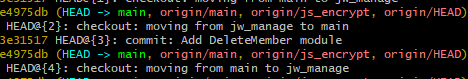

## 삭제한 브랜치 복구

```
git refolg
```



헤드 번호 확인 후

```
# git checkout -b '브랜치이름' HEAD#{숫자}

git checkout -b 'jw_manage' HEAD@{3}
```


입력 후 다시 확인해보기

```
git log
```


푸시해주기

```
git push --set-upstream main jw_manage
```

