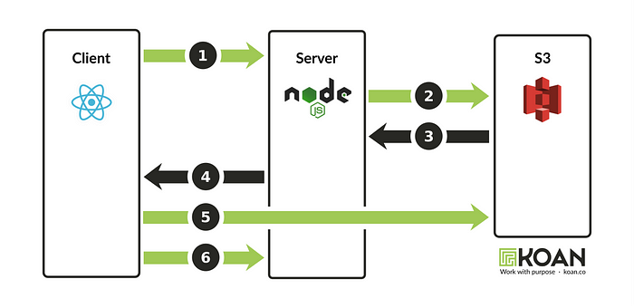
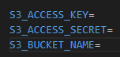

 

### [presigned Url?](https://kimwonny.tistory.com/139#presigned Url%3F-1)




출처:&nbsp;https://medium.com/developing-koan/uploading-images-to-s3-from-a-react-single-page-application-45a4d24af09f


1. 클라이언트는 서버로부터 사전 서명된 업로드 URL을 요청합니다.
2. 서버는 이 요청을 S3로 전달합니다.
3. S3는 새로운 사전 서명된 URL을 서버에 반환합니다.
4. 서버는 사전 서명된 URL을 클라이언트에 반환합니다.
5. 사용자는 컴퓨터에서 파일을 선택하고 클라이언트는 선택한 파일을 사전 서명된 URL(즉, S3에 직접)에 업로드합니다.
6. 클라이언트는 서버에 다시 요청을 보내어 업로드가 완료되었음을 알립니다.

 

서버에서 S3 버킷으로 파일을 업로드 하려면 우선 업로드 하려는 파일을 브라우저에서 서버로 보낸 뒤, 해당 파일을 S3 버킷으로 업로드 하는 과정을 거쳐야 한다.

이 과정은 무거운 이미지 파일을 서버로 전송하는 과정이 포함되어 있어서 자원이 많이 소모되어 비효율적이다.

다른 방법으로는 서버를 배제한 채 presigned URL 발급 로직 및 업로드 로직을 브라우저에서 전부 진행하는 방법이 있지만, 이 또한 브라우저의 보안이 굉장히 취약하단 점을 감안했을 때 좋지 않은 방법이다.

 

그래서 나는 위와 같은 방식으로 진행했다!

------

node에서 presigned url 을 받아, vue에서 직접 s3에 업로드 하는 코드

### [전송시 Vue 코드](https://kimwonny.tistory.com/139#전송시 Vue 코드-1)

```xml
  <input  type="file" ref="image" accept="image/*" @change="saveImage()">
async saveImage() {
      try {
        const selectedFile = this.$refs.image.files[0];
        const maxSize = 5 * 1024 * 1024;
        const fileSize = selectedFile.size;
        if (fileSize > maxSize) {
          alert("첨부파일 사이즈는 5MB 이내로 등록 가능합니다.");
          return;
        }
        const filename = selectedFile.name;  
        
        const res = await axios.get('/api/s3/url', {
          params: { filename },
        });
        const encodedFileName = res.data.encodedFileName;
        const presignedUrl = res.data.presignedUrl;
        
        await axios.put(presignedUrl, selectedFile)
        .then((res) => {
          console.log(res);
        })

        console.log('이미지 업로드 완료');
      } catch (error) {
        console.error('이미지 업로드 오류:', error);
      }
    },
```

 

### [Node 코드](https://kimwonny.tistory.com/139#Node 코드-1)

/api/s3/url로 보내면 node로 가서, 아래의 getPresignedURL 메소드를 실행하게 된다.

라이브러리를 설치했다.

```bash
npm i @aws-sdk/client-s3 @aws-sdk/s3-request-presigner dotenv uuid
```

겹치지 않게 uuid도 추가해주었고, .env 파일에 아래와 같은 내용도 추가해주었다.





```javascript
const { v4: uuidv4 } = require('uuid');
const dotenv = require('dotenv');
const { S3Client, PutObjectCommand } = require('@aws-sdk/client-s3');
const { getSignedUrl } = require('@aws-sdk/s3-request-presigner');

dotenv.config();

const s3 = new S3Client({
  region: 'ap-northeast-2',
  credentials: {
    accessKeyId: process.env.S3_ACCESS_KEY,
    secretAccessKey: process.env.S3_ACCESS_SECRET,
  },
});

exports.getPresignedURL = async (req, res) => {
  try {
    const { filename } = req.query;
    const encodedFileName = `${filename}-${uuidv4()}`;

    const command = new PutObjectCommand({
      Bucket: process.env.S3_BUCKET_NAME,
      Key: 'public/'+encodedFileName,
    });

    const presignedUrl = await getSignedUrl(s3,command, {expiresIn: 180});

    res.json({ presignedUrl, encodedFileName});
    // console.log(presignedUrl);

  } catch (error) {
    console.error('PresignedURL 생성 오류:', error);
    res.status(500).json({ error: 'PresignedURL 생성 오류' });
  }
};
```

- config/s3.js 안에 s3 설정을 넣어놔도 되지만, 필자는 사용하는 곳이 여기뿐이라 그냥 여기 적었다.
- expiressIn 은 presignedUrl의 만료시간

 

이렇게 s3에 업로드하고 url을 받아서 DB에 저장하면 끝!


 

[참조 글](https://medium.com/developing-koan/uploading-images-to-s3-from-a-react-single-page-application-45a4d24af09f)