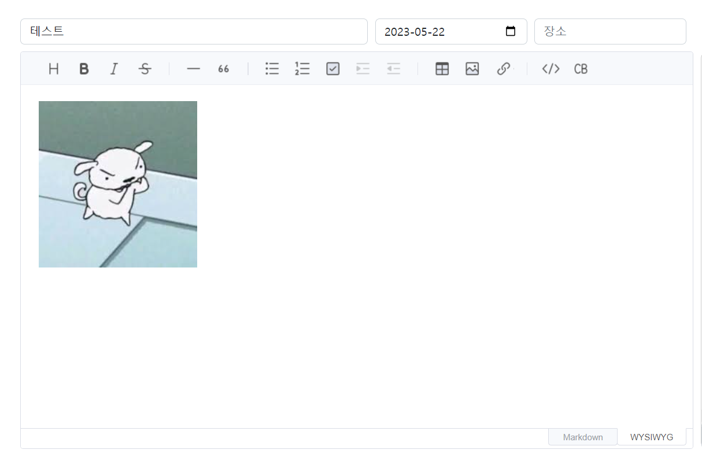
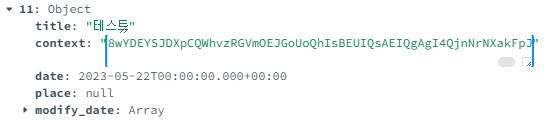
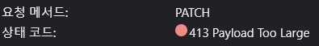
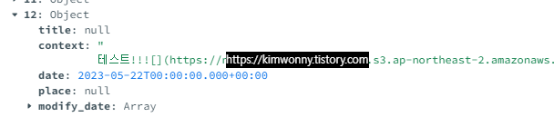

프로젝트 진행 중, 마크다운 에디터로 [toast-ui/vue-editor](https://ui.toast.com/tui-editor)를 사용하고 있는데,

해당 에디터에서 사진 파일 업로드 시 base64 형태로 반환된다.

base64이라 길이가 엄청 길기 때문에, s3에 업로드하고 해당 url을 content에 저장하는 방법으로 변경하였다.






이렇게 엄청 길게 들어가게 돼서, 조금만 용량 큰 사진을 업로드하면 아래와 같이 413 오류가 떴다.




그래서 변경한 방법

```javascript
<Editor ref="toastEditor" 
        initialEditType="wysiwyg" 
        previewStyle="vertical"
        :options="options" />
<script>
    import { Editor } from '@toast-ui/vue-editor'
	import '@toast-ui/editor/dist/toastui-editor.css' // Editor style
    
    data(){
        return{
            options: {
                language: "ko",
                hooks: {
                  addImagebase64Hook: this.onUploadImage
                }
              },
        }
    },
   components: {
    Editor
  	},
   methods: {
        async onUploadImage(base64, callback) {
      const formData = new FormData();
      formData.append('file', base64);

      try {
        const imageUrl = await this.saveImage(formData);
        callback(imageUrl);
      } catch (error) {
        console.error('이미지 업로드 오류:', error);
        throw error;
      }
    },
    async saveImage(formData) {
      try {
		// 업로드 하는 코드
        return imageUrl;
      } catch (error) {
        console.error('이미지 업로드 오류:', error);
        throw error;
      }
    },
   }
</script>
```

Vue.js와 Toast UI Editor를 사용하는 경우엔 바로 hooks 옵션을 주니 인식이 되지 않아서

이런식으로 options 에서 hooks 메소드를 추가했다.

( Toast UI Editor는 Vue.js와 함께 사용될 때, 옵션을 정의하기 위해 `options` 객체를 사용한다고 함)

 





해당 위치에 url이 반환되어 저장된 모습을 볼 수있다!😊

 

node와 vue를 연동한 프로젝트에서 presigned url을 적용한 s3 업로드는 아래에 게시되어 있다!


```js
 <Editor ref="toastEditor" 
        initialEditType="wysiwyg" 
        height="550px" 
        previewStyle="vertical"
        :options="options" />
```

```vue
<script>
    import { Editor } from '@toast-ui/vue-editor'
	import '@toast-ui/editor/dist/toastui-editor.css' // Editor style
    
    data(){
        return{
            options: {
                language: "ko",
                hooks: {
                  addImagebase64Hook: this.onUploadImage
                }
              },
        }
    },
   components: {
    Editor
  	},
   methods: {
        async onUploadImage(base64, callback) {
      const formData = new FormData();
      formData.append('file', base64);

      try {
        const imageUrl = await this.saveImage(formData);
        callback(imageUrl);
      } catch (error) {
        console.error('이미지 업로드 오류:', error);
        throw error;
      }
    },
    async saveImage(formData) {
      try {
        const res = await axios.get('/api/s3/url', {
          params: { filename: formData.get('file').name },
        });
        const encodedFileName = res.data.encodedFileName;
        const presignedUrl = res.data.presignedUrl;

        await axios.put(presignedUrl, formData.get('file'));
        const imageUrl = `{s3주소}/public/${encodedFileName}`;
        console.log('이미지 업로드 완료');
        return imageUrl;
      } catch (error) {
        console.error('이미지 업로드 오류:', error);
        throw error;
      }
    },
   }
</script>
```

```js
const { v4: uuidv4 } = require('uuid');
const dotenv = require('dotenv');
const { S3Client, PutObjectCommand } = require('@aws-sdk/client-s3');
const { getSignedUrl } = require('@aws-sdk/s3-request-presigner');

dotenv.config();

const s3 = new S3Client({
  region: 'ap-northeast-2',
  credentials: {
    accessKeyId: process.env.S3_ACCESS_KEY,
    secretAccessKey: process.env.S3_ACCESS_SECRET,
  },
});

exports.getPresignedURL = async (req, res) => {
  try {
    const { filename } = req.query;
    const encodedFileName = `${filename}-${uuidv4()}`;

    const command = new PutObjectCommand({
      Bucket: process.env.S3_BUCKET_NAME,
      Key: 'public/'+encodedFileName,
    });

    const presignedUrl = await getSignedUrl(s3,command, {expiresIn: 3600});

    res.json({ presignedUrl, encodedFileName});
    // console.log(presignedUrl);

  } catch (error) {
    console.error('PresignedURL 생성 오류:', error);
    res.status(500).json({ error: 'PresignedURL 생성 오류' });
  }
};

```

