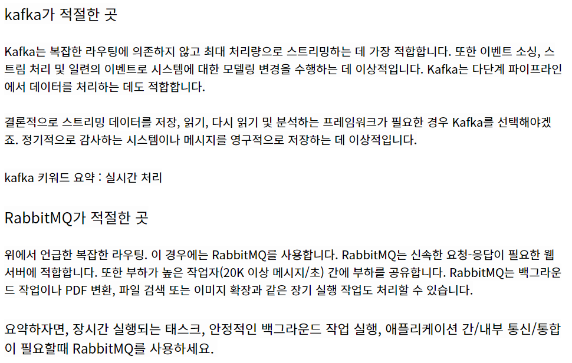
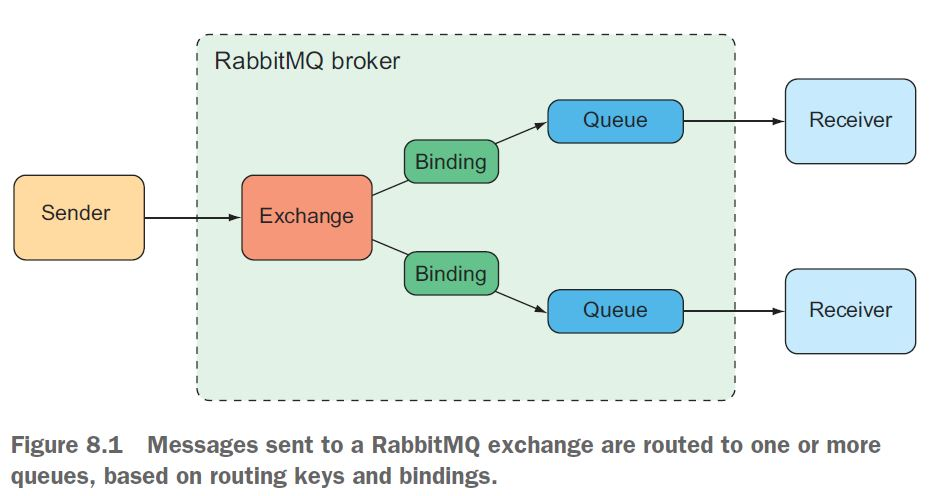

# RabbitMQ

### 사용하는 이유

- open ai api를 사용중인데, 1분당 처리 가능한 요청수가 적어서 조절해서 보내려고 함

### RabbitMQ 를 선택한 이유

https://stackoverflow.com/questions/42151544/when-to-use-rabbitmq-over-kafka/42154452#42154452

https://www.cloudamqp.com/blog/when-to-use-rabbitmq-or-apache-kafka.html




## [RabbitMQ 구조](https://wecandev.tistory.com/50)




## [Springboot 와 RabbitMQ 연동](https://spring.io/guides/gs/messaging-rabbitmq/)

1. RabbitMQ 설정:
   - Spring Boot 프로젝트에 RabbitMQ를 사용하기 위해 의존성을 추가합니다. (`pom.xml` 파일에 `spring-boot-starter-amqp`를 추가하거나 Gradle을 사용한다면 `build.gradle` 파일에 `implementation 'org.springframework.boot:spring-boot-starter-amqp'`를 추가합니다.)
   - `application.properties` 파일에 RabbitMQ 연결 및 큐 설정을 추가합니다:
     ```properties
     spring.rabbitmq.host=your-rabbitmq-host
     spring.rabbitmq.port=your-rabbitmq-port
     spring.rabbitmq.username=your-rabbitmq-username
     spring.rabbitmq.password=your-rabbitmq-password
     ```
   - RabbitMQ에 요청을 보낼 수 있는 RabbitTemplate을 생성하고 주입하는 Configuration 클래스를 작성합니다:
     ```java
     import org.springframework.amqp.rabbit.connection.ConnectionFactory;
     import org.springframework.amqp.rabbit.core.RabbitTemplate;
     import org.springframework.amqp.support.converter.Jackson2JsonMessageConverter;
     import org.springframework.context.annotation.Bean;
     import org.springframework.context.annotation.Configuration;
     
     @Configuration
     public class RabbitMQConfig {
     
         @Bean
         public RabbitTemplate rabbitTemplate(ConnectionFactory connectionFactory) {
             RabbitTemplate template = new RabbitTemplate(connectionFactory);
             template.setMessageConverter(new Jackson2JsonMessageConverter());
             return template;
         }
     }
     ```

2. 요청 전송:
   - Vue.js에서 요청을 생성하고 Spring Boot에 RabbitMQ 큐로 전송하는 방법을 구현합니다.
   - RabbitTemplate을 사용하여 요청을 큐에 전송하는 메서드를 작성합니다:
     ```java
     import org.springframework.amqp.rabbit.core.RabbitTemplate;
     import org.springframework.web.bind.annotation.PostMapping;
     import org.springframework.web.bind.annotation.RequestBody;
     import org.springframework.web.bind.annotation.RestController;
     
     @RestController
     public class RequestController {
     
         private RabbitTemplate rabbitTemplate;
     
         public RequestController(RabbitTemplate rabbitTemplate) {
             this.rabbitTemplate = rabbitTemplate;
         }
     
         @PostMapping("/request")
         public void handleRequest(@RequestBody Request request) {
             rabbitTemplate.convertAndSend("your-queue-name", request);
         }
     }
     ```

3. 요청 처리:
   - RabbitMQ 메시지 수신을 위해 MessageListener를 구현합니다:
     ```java
     import org.springframework.amqp.core.Message;
     import org.springframework.amqp.core.MessageListener;
     import org.springframework.amqp.support.converter.MessageConverter;
     import org.springframework.stereotype.Component;
     
     @Component
     public class RequestMessageListener implements MessageListener {
     
         private MessageConverter messageConverter;
     
         public RequestMessageListener(MessageConverter messageConverter) {
             this.messageConverter = messageConverter;
         }
     
         @Override
         public void onMessage(Message message) {
             Request request = (Request) messageConverter.fromMessage(message);
             // OpenAI API를 사용하여 요청 처리
              // ...
      
              // 처리된 결과를 반환
              // ...
          }
      }

4. RabbitMQ 메시지 리스너 등록:
   - 메시지 리스너를 등록하여 RabbitMQ 큐로부터 요청을 가져와 처리합니다. 이를 위해 Spring Boot 애플리케이션 시작 시 RabbitMQ 컨테이너에 메시지 리스너를 등록합니다:
     ```java
     import org.springframework.amqp.rabbit.listener.SimpleMessageListenerContainer;
     import org.springframework.amqp.rabbit.listener.adapter.MessageListenerAdapter;
     import org.springframework.context.annotation.Bean;
     import org.springframework.context.annotation.Configuration;
     
     @Configuration
     public class RabbitMQListenerConfig {
     
         private static final String QUEUE_NAME = "your-queue-name";
         private static final int CONCURRENT_CONSUMERS = 1;
     
         @Bean
         public MessageListenerAdapter messageListenerAdapter(RequestMessageListener listener, MessageConverter messageConverter) {
             MessageListenerAdapter adapter = new MessageListenerAdapter(listener, "onMessage");
             adapter.setMessageConverter(messageConverter);
             return adapter;
         }
     
         @Bean
         public SimpleMessageListenerContainer messageListenerContainer(ConnectionFactory connectionFactory, MessageListenerAdapter messageListenerAdapter) {
             SimpleMessageListenerContainer container = new SimpleMessageListenerContainer();
             container.setConnectionFactory(connectionFactory);
             container.setQueueNames(QUEUE_NAME);
             container.setMessageListener(messageListenerAdapter);
             container.setConcurrentConsumers(CONCURRENT_CONSUMERS);
             return container;
         }
     }
     ```

위의 코드는 RabbitMQ를 사용하여 대기열을 구현하는 방법을 보여주는 간단한 예시입니다. `RequestMessageListener` 클래스는 RabbitMQ에서 메시지를 수신하고 처리하는 역할을 담당하며, `RequestController` 클래스에서는 Vue.js에서 요청이 생성되면 RabbitMQ 큐로 전송합니다. 또한, 메시지 리스너를 등록하기 위한 `RabbitMQListenerConfig` 클래스를 작성합니다.

이 방법을 통해 요청을 RabbitMQ 큐에 안전하게 저장하고 처리할 수 있으며, Spring Boot 애플리케이션이 요청 횟수 제한을 고려하여 메시지를 가져와 처리합니다.
