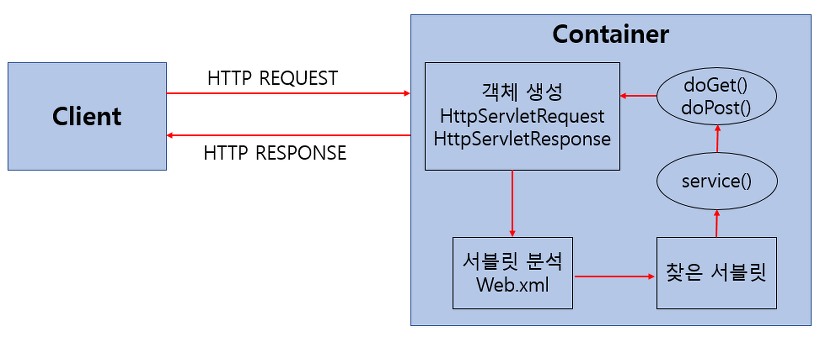

#  📌Servlet

- 웹 서버의 성능을 향상하기 위해 사용되는 자바 클래스의 일종
- 클라이언트가 어떠한 요청을 하면 그에 대한 결과를 다시 전송해주어야 하는데, 이러한 역할을 하는 자바 프로그램
- WAS내의 서블릿 컨테이너에서 동작
- 요청(Request)을 받으면 요청에 맞는 로직을 실행하고 클라이언트에게 HTTP 형식으로 응답(Response)

## Servlet 동작 방식

> 
>
> 1. 사용자(클라이언트)가 URL을 입력하면 HTTP Request가 Servlet Container로 전송합니다.
> 2. 요청을 전송받은 Servlet Container는 HttpServletRequest, HttpServletResponse 객체를 생성합니다.
> 3. web.xml을 기반으로 사용자가 요청한 URL이 어느 서블릿에 대한 요청인지 찾습니다.
> 4. 해당 서블릿에서 service메소드를 호출한 후 클리아언트의 GET, POST여부에 따라 doGet() 또는 doPost()를 호출합니다.
> 5. doGet() or doPost() 메소드는 동적 페이지를 생성한 후 HttpServletResponse객체에 응답을 보냅니다.
> 6. 응답이 끝나면 HttpServletRequest, HttpServletResponse 두 객체를 소멸시킵니다.

[출처](https://mangkyu.tistory.com/14)

## Servlet Container(서블릿 컨테이너)

- 서블릿을 관리해주는 컨테이너
- 서블릿 컨테이너는 클라이언트의 요청(Request)을 받아주고 응답(Response)할 수 있게, 웹서버와 소켓으로 통신 
- 대표적인 예로 톰캣(Tomcat)
  - 실제로 웹 서버와 통신하여 JSP(자바 서버 페이지)와 Servlet이 작동하는 환경을 제공