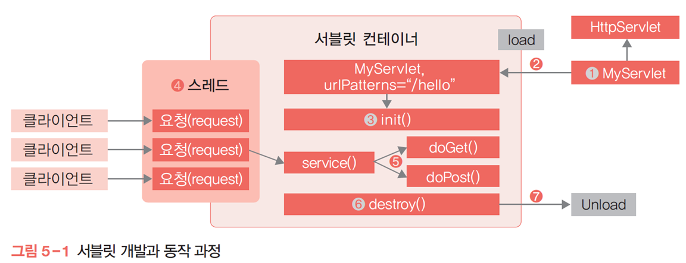
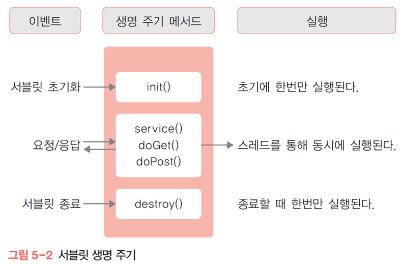
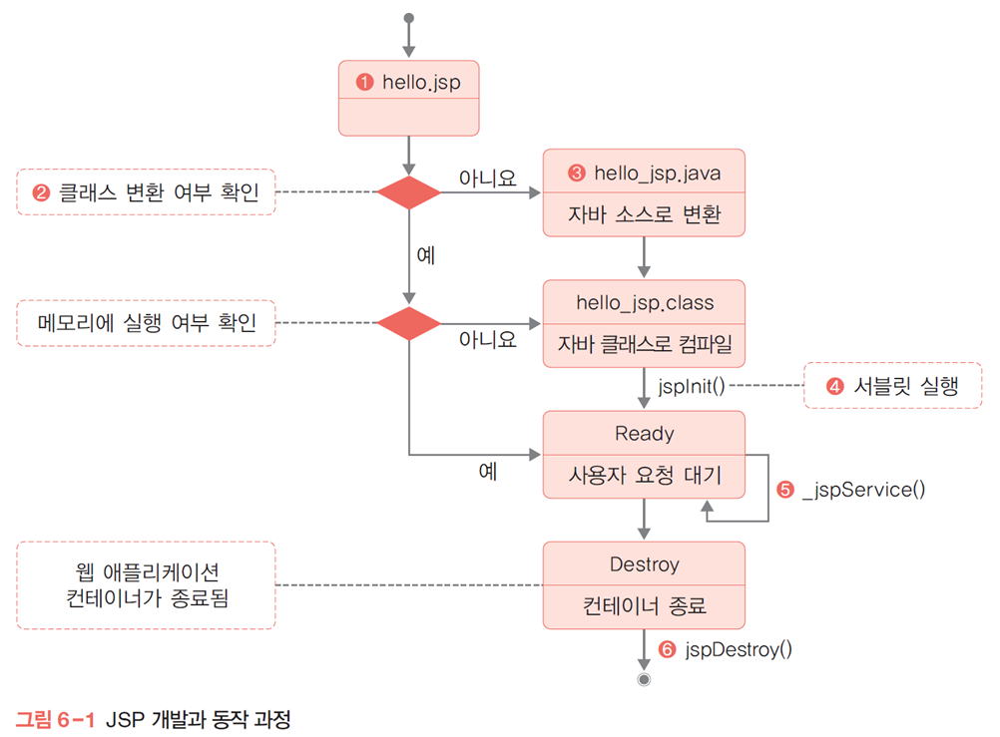

[toc]

# 4장

## 서블릿?

서버에서 돌아가는 자바클래스

만들때부터 자바 파일 -> 클래스

## jsp 실행 과정 

jsp는 태그형식으로 돌아가기 편하게 만드는것 

둘다 서블릿형태로 돌아감

전형적인 웹사이트는 JSON형식으로 넘어감

## REST ⭐

- 네트워크상에서 클라이언트와 서버 사이의 통신을 구현하는 방법 중 하나
- url에 요청되는 게 바로처리되는 구조가 Rest한 아키텍처
- 서버 응답을 다양한 형태로 전달하는 개념

## REST API

ex) ~.com/current/city/seoul

1. JAX-RS
2. 스프링프레임워크 RestController

### @ 어노테이션

- 컴파일할 때 자동으로 매칭됨, 메타 데이터

## 스프링 프레임워크

- 자바 기반의 오픈 소스 프레임워크
- Java EE(Enterprise Edition, 기업 버전의 자바 솔루션을 만드는 것) 을 Java EE 사용하지 않고 구현하려고 시작

### 특징

1. 경량 컨테이너 

   - 가볍진 않지만, 자바 EE에 비해 경량하다는 의미

2. **제어의 역행(Inversion of Control, IoC)** 지원

   - 메서드나 객체의 호출 제어권이 사용자가 아닌 프레임워크에 있어 필요에 따라 스프링에서 사용자의 코드를 호출한다.
   - 스프링 자체가 IoC 컨테이너를 갖고 있고, 알아서 인스턴스를 만들고 만들어진 인스턴스에 다양한 클래스 조합들을 끝에서 부터 하나씩 만들어서 내 목적에 맞게 만들어주는 걸 spring이 한다는 것

3. **의존성 주입(Dependency Injection, DI)** 지원

   - 각 계층이나 서비스 간에 의존성이 존재할 경우 프레임워크가 서로 연결해줌
   - A라는 객체를 운영하다가 B가 필요한데, 둘다 엮으면 너무 밀접관계가 되기때문에 해당 부분에서만 가져와서 연결시켜주는 작업을 스프링이 함
   - 필요에 따라 스프링이 가져와서 연결시켜준다.

4. **관점 지향 프로그래밍(Aspect-Oriented Programming, AOP) **지원

   - 트랜잭션이나 로깅, 보안과 같이 여러 모듈에서 공통적으로 사용하는 기능의 경우 해당 기능을 분리하여 관리할 수 있음
   - 이미 만들어진 프로그램 코드(ex. 클래스)가 돌아갈 때, 언제 실행되는 지 남기는 게 로깅
   - 코드 앞 뒤에 뭐가 붙어도 원래 있던 애랑 똑같은 걸로 느낌
   - 프록시 패턴과 연관

   

### 스프링의 목적

서로 간의 연관성을 느슨하게 만들겠다는 목적을 갖고있음 (결합도를 낮춰서 유연하게, 즉 변화를 쉽게 적용할 수 있도록 만드는 것)

## 스프링 부트

- 스프링 프레임워크 프로젝트를 손쉽게 시작할 수 있도록 하며 개발과 관련한 스프링 구성요소를 편하게 관리할 수 있도록 한다.

1. 서블릿 스택
   - 동기 방식의 블로킹 구조
2. 리액티브 스택 
   - 비동기 논블로킹 구조
   - 대규모, 동접자가 많을 때

### 블로킹과 논블로킹

- 블로킹 : 작업이 완료될 때까지 프로그램을 일시 중지(계속 waiting)한다.
- 논블로킹 : 프로그램이 작업이 완료되기를 기다리는 동안 다른 작업을 계속 실행한다.

# 5장

## 서블릿 동작 과정

1. MyServlet(자바로 만들어진 클래스) load
2. init() 메소드 먼저 실행 - HttpServlet 상속 받은 애는 init 메소드 무조건 구현
3. service() 실행 
4. doGet() or doPost()
5. destroy()
6. unload

### 서블릿 생명 주기

### 서블릿 클래스 구조

- javax.servlet.Servlet 인터페이스를 구현한 추상 클래스인 GenericServlet 클래스와 HttpServlet 클래스 중 하나를 상속해 구현한다.
- HttpServlet을 상속받아 doGet( ), doPost( ) 메서드를 오버라이딩한 구조

### 서블릿 정보 등록

- 서블릿 2.0
  - web.xml 이나 애너테이션으로 서블릿임을 선언해야 한다.
- 서블릿 3.0
  - 애너테이션을 이용해 등록한다.(권장)

### scope object

page, request, session, application 에 대해 조사

- 주의할 점) 저장하고자 하는 데이터가 Object 형태임
  - Object 타입은 데이터를 가지고 올 때 리턴된 Object 타입을 원래 저장된 데이터 타입으로 변환해야 함

@WebServlet 애너테이션 실습 캡쳐

# 6장

## JSP

### JSP 동작 과정

