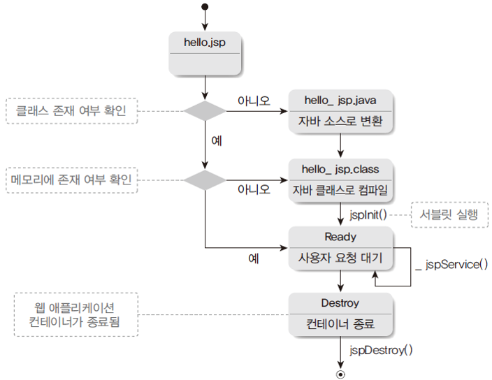
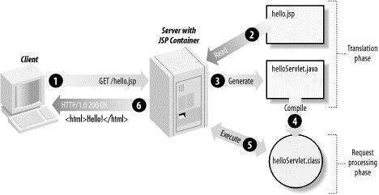

# JSP (JavaServer Pages)

HTML 코드에 JAVA 코드를 넣어 동적웹페이지를 생성하는 웹어플리케이션 도구이다.

JSP 가 실행되면 자바 서블릿(Servlet) 으로 변환되며 웹 어플리케이션 서버에서 동작되면서 필요한 기능을 수행하고

그렇게 생성된 데이터를 웹페이지와 함께 클라이언트로 응답한다.

------

## 웹어플리케이션(Web Application)

웹어플리케이션은 웹에서 실행되는 응용프로그램을 뜻하며 인터넷을 통한 은행업무, 인터넷쇼핑, 등등 인터넷에서 하는 여러 서비스를 총칭

하며 사용자가 필요한 요청(Request) 를 하고 서버에서는 이에 해당하는 요청을 수행하고 그리고 요청한 데이터를 응답(Response) 한다.

웹 어플리케이션이 위와 같이 동작하기 위한 몇가지 구성요소가 있다.

웹 브라우저(Web Browser) : 클라이언트에서 요청을 하고 전달받은 페이지를 볼수있는 환경을 말한다. ( 크롬, IE, Safari, Firefox 등.. )

웹 서버(Web Server) : 클라이언트로 부터 요청받아 서버에 저장된 리소스를 클라이언트 에게 전달한다. 주로 정적컨텐츠롤 담당한다.

웹 어플리케이션 서버 ( Web Application Server ) : 줄여서 was 라고도 부르며 서버단에서 필요한 기능을 수행하고 그결과를 웹서버에게 전달한다.

데이터베이스 : 서비스에 필요한 데이터를 보관, 갱신 등 관리를 한다.

------

## 자바 서블릿(Java Servlet)

서블릿이란 웹페이지를 동적으로 생성하기 위해 서버측 프로그램을 말한다. 

이는 자바 언어를 기반으로 만들지며 웹 어플리케이션 서버 ( Web Application Sever ) 위에서 컴파일 되고 동작한다.

------

## JSP 와 서블릿

JSP 와 서블릿의 차이점은 결과적으로 하는일은 동일하지만 

JSP 는 HTML 내부에 JAVA 소스코드가 들어감으로 인해 HTML 코드를 작성하기 간편하다는 장점이있으며

서블릿은 자바코드내에 HTML 코드가 있어서 읽고 쓰기가 굉장히 불편하기 때문에 작업의 효율성이 떨어진다.

JSP 로 작성된 프로그램은 서버로 요청시 서블릿(Servlet) 파일로 변환되어 JSP 태그를 분해하고 추출하여 다시 순수한 HTML 를 변환한다.

1. 클라이언트가 어떤 동작을 함으로써 hello.jsp 를 요청하였다.
2. JSP 컨테이너가 JSP 파일을 읽는다.
3. JSP 컨테이너가 Generete (변환) 작업을 통해 Servlet ( .java ) 파일을 생성한다.
4. .java 파일은 다시 .class 파일로 컴파일된다.
5. Execute (실행) 을통해 HTML 파일을 생성하여 JSP 컨테이너 에게 전달한다.
6. JSP 는 HTTP 프로토콜을 통해 HTML 페이지를 클라이언트 에게 전달한다.

## JSP 태그

출처

https://devlog-wjdrbs96.tistory.com/152

https://javacpro.tistory.com/43

https://dinfree.com/lecture/backend/javaweb_2.2.html