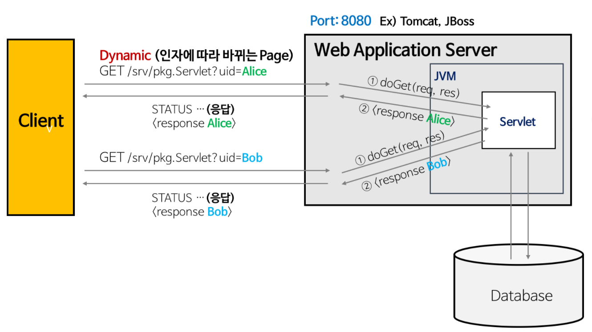

# Web Server와 WAS의 차이

## Web Server

- 웹 브라우저 클라이언트로부터 HTTP 요청을 받아 정적인 컨텐츠(.html .jpeg .css 등)를 제공하는 컴퓨터 프로그램

- HTTP 프로토콜을 기반으로 하여 클라이언트(웹 브라우저 또는 웹 크롤러)의 요청을 서비스 하는 기능을 담당한다.

  

- 요청에 따라 아래의 두 가지 기능 중 적절하게 선택하여 수행한다.
  - 기능 1) 
  	- 정적인 컨텐츠 제공
  	- WAS를 거치지 않고 바로 자원을 제공한다.
  - 기능 2)
    - 동적인 컨텐츠 제공을 위한 요청 전달
    - 클라이언트의 요청(Request)을 WAS에 보내고, WAS가 처리한 결과를 클라이언트에게 전달(응답, Response)한다.
    - 클라이언트는 일반적으로 웹 브라우저를 의미한다.
  - Web Server의 예
    - Ex) Apache Server, Nginx, IIS(Windows 전용 Web 서버) 등

## WAS(Web Server + Web Container)

-  DB 조회나 다양한 로직 처리를 요구하는 동적인 컨텐츠를 제공하기 위해 만들어진 Application Server

- HTTP를 통해 컴퓨터나 장치에 애플리케이션을 수행해주는 미들웨어(소프트웨어 엔진)이다.

- “웹 컨테이너(Web Container)” 혹은 “서블릿 컨테이너(Servlet Container)”라고도 불린다.

  - Container란 JSP, Servlet을 실행시킬 수 있는 소프트웨어를 말한다.
  - 즉, WAS는 JSP, Servlet 구동 환경을 제공한다.

- WAS의 예

  - Ex) Tomcat, JBoss, Jeus, Web Sphere 등

    

    https://gmlwjd9405.github.io/2018/10/27/webserver-vs-was.html

