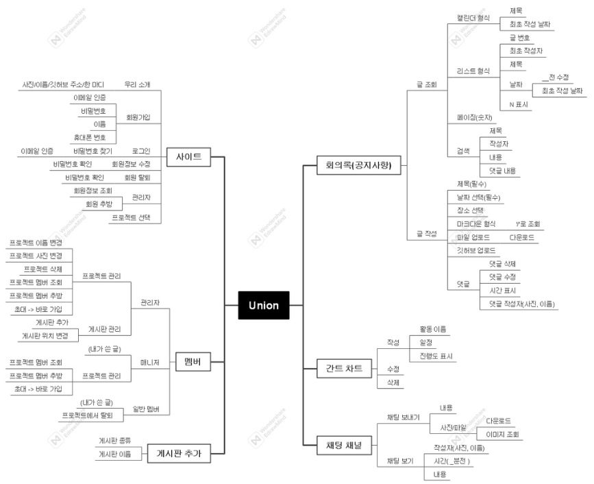

# NotShovel-Union

***

## 👩‍💻 NotShovel

- [김정원](https://github.com/kimwonny8)
- [김정수](https://github.com/YJU-KimJeongSu)
- [반영서](https://github.com/bys096)

***

### ⏰ 진행 기간

- 기획 : 1월 26일 ~ 3월 
- 개발 : 3월 28일 ~

### 🖥️ 사용 기술 및 개발 환경

- Mac, Window
- Visual Studio Code
- Node18
- Vue2
- Mongoose7
- Mongodb6

### 📌 기획 배경

- 팀 프로젝트를 진행할 때, 실시간으로 회의록을 작성되는 걸 보며 채팅을 할 수 있으면 좋을것 같아서 기획하게 됨. 
- 모두가 합쳐 함께 진행해보자는 의미에서 프로젝트 이름을 Union 이라고 지음

### 📌 기능

1. 회의록(공지사항)
   1. 깃허브 업로드 (자동)
   2. [마크다운](https://inpa.tistory.com/entry/MarkDown-📚-마크다운-문법-💯-정리) 형식 작성 
   3. 슬래시로 기능(마크다운 문법, 파일, 표) 
   4. 채팅 - 사진, 파일, 전부 다
   5. 일정 필수 선택 - 캘린더로 전환 가능
   6. 새로 올라온 글에 N 표시

2. 간트 차트
   1. 따로 사용자가 작성
   2. 추후 분석 기능 추가 예정

3. 채팅 채널

   1. 사진, 파일, 전부 다 

   2. 모든 채팅/음성 통화 기능 -> 디코 같은

4. 게시판 추가 - 회의록, 간트 차트, 채팅은 여러 개 추가 가능

5. 설문 - 보류. 작업할 때 네이버웍스 참고

### 📌 마인드맵

