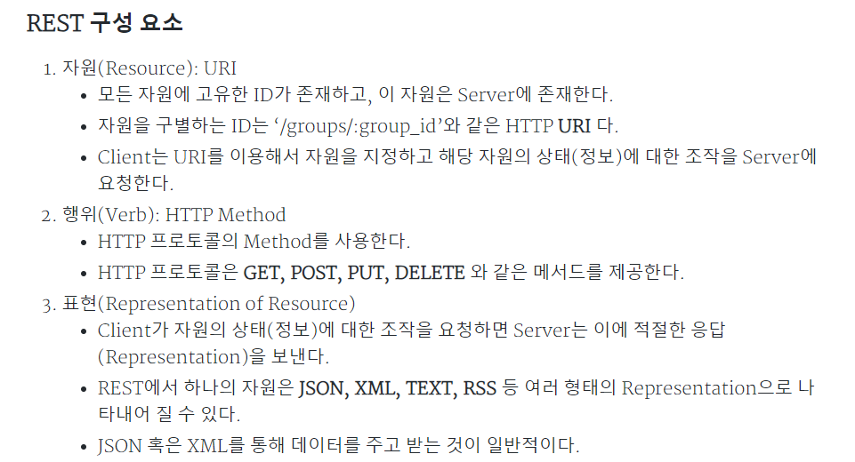

# 면접 질문 리스트

https://dev-coco.tistory.com/153

### 웹서버(WEB)와 웹 애플리케이션 서버(WAS) 차이

- 웹 서버
  - 클라이언트가 웹 브라우저에서 어떠한 요청을 하면 그 요청을 받아 **정적 컨텐츠**를 제공하는 서버
    - 정적? 단순 HTML, CSS, JS, 이미지 파일 등 즉시 응답 가능한 컨텐츠
  - 동적 컨텐츠 요청을 받으면 WAS에게 넘겨주고, 그 결과를 클라이언트에게 전달해주는 역할도 함
  - ex) Apache
- 웹 애플리케이션 서버
  - 웹 서버 + 웹 컨테이너
    - 웹 컨테이너? 웹서버가 보낸 JSP, PHP 수행한 결과를 다시 웹서버로 보내주는 역할
  - DB 조회 혹은 다양한 로직 처리를 요구하는 **동적 컨텐츠**를 제공하기 위해 만들어진 Application 서버
    - 동적? 함은 서버가 사용자의 '요청(Request)'에 따라 데이터를 가공처리한 뒤에 생성되어진 웹 페이지를 보여주는 것
  - JSP, Servlet 구동환경을 제공해주기 때문에 서블릿 컨테이너 혹은 웹 컨테이너로 불린다.
  - ex) Tomcat

### JVM?

- 스택 기반으로 동작
- Java Byte Code를 OS에 맞게 해석 해주는 역할을 하고 가비지컬렉션을 통해 자동적인 메모리 관리를 함
  - 가비지 컬렉션?
    - 동적으로 할당했던 메모리 영역 중 필요 없게 된 메모리 영역을 주기적으로 삭제하는 프로세스

###  Java의 컴파일 과정

- 우리가 작성한 소스코드가 기계가 읽을 수 있는 형태로 변환되는 과정이 컴파일 타임

- .java 파일을 생성 → build → java compiler의 javac의 명령어를 통해 바이트코드(.class)를 생성

  → Class Loader를 통해 JVM 메모리 내로 로드 → 실행엔진을 통해 컴퓨터가 읽을 수 있는 기계어로 해석(각 운영체제에 맞는 기계어)

### 런타임

- 프로그램이 동작되어지는 때

### 자바의 메모리 공간 영역

- 메소드 영역
  - 전역 변수와 static 변수 저장
  - 프로그램 시작부터 종료까지 남아있음
- 스택 영역(컴파일 타임시 할당)
  - 지역변수와 매개변수 데이터 값이 저장
  - 메소드가 호출될 때 메모리에 할당되고 종료되면 메모리가 해제
- 힙 영역(런타임시 할당)
  - new 키워드로 생성되는 객체(인스턴스), 배열 등이 Heap 영역에 저장
  - 가비지 컬렉션에 의해 메모리가 관리되어 진다.

### OOP 정의는?

- OOP는 Object Oriented Programming의 줄임말이고, 객체 지향 프로그래밍을 의미한다.
- 우리가 실생활에서 쓰는 모든 것을 객체라 하며, 객체 지향 프로그래밍은 프로그램 구현에 필요한 객체를 파악하고 상태와 행위를 가진 객체를 만들고 각각의 객체들의 역할이 무엇인지를 정의하여 객체들 간의 상호작용을 통해 프로그램을 만드는 것
- 기능이 아닌 **객체가 중심**이며 **"누가 어떤 일을 할 것인가?"**가 핵심

### 클래스와 객체의 차이점은?

- 클래스(Class)
  - 객체를 정의하는 틀 또는 설계도를 의미

- 객체(Object)
  - 식별 가능한 개체 또는 사물
  - 구별 가능한 식별자, 특징적인 행동, 변경 가능한 상태를 가진다. 
  - 객체에 메모리가 할당되어 실제로 활용되는 실체는 '인스턴스'


### C와 Java의 차이점은? 

- C언어는 순차적으로 읽어가는 절차 지향 언어
- Java는 클래스를 사용하고 설계적인 측면이 강조된 객체지향 언어.
   - 자바 - JRE는 자바 실행환경이고, JDK는 자바 개발 도구


### Java와 JavaScript의 차이점은? 

- Java
  - 가상 시스템 또는 브라우저에서 실행되는 응용 프로그램을 작성
  - 컴파일이 필요
- Java Script
  - 스크립트 언어
    - 소스 코드를 컴파일(Compile)하지 않고도 실행할 수 있는 프로그래밍 언어

  - JavaScript 코드는 브라우저에서만 실행됩니다. 


### Java와 Python의 차이점?

- 파이썬
  - 스크립트 언어

- 자바 
  - 컴파일 언어
  - 자바 언어는 자바 compiler 를 통과하고 나면, .class라는 Bytecode가 생긴다. Bytecode 생긴 다음, JVM (자바 가상머신)이 run 하는 환경에서 번역기 통해서 class 가 실행된다. 


### 자바 버전별 차이

https://techblog.gccompany.co.kr/%EC%9A%B0%EB%A6%AC%ED%8C%80%EC%9D%B4-jdk-17%EC%9D%84-%EB%8F%84%EC%9E%85%ED%95%9C-%EC%9D%B4%EC%9C%A0-ced2b754cd7

### 람다? 

- 함수를 하나의 식(expression)으로 표현한 익명 함수
- 메소드명이 불필요, 괄호와 화살표 이용
- 불필요한 코드를 줄이고 가독성을 높이기 위해 사용함
- 디버깅이 어렵고 재사용이 불가능하며 재귀로 만들 경우에는 부적합

### 스프링 Bean? 

- 스프링 컨테이너에 의해 관리되는 재사용 가능한 소프트웨어 컴포넌트
- 인스턴스화된 객체를 의미하며, 스프링 컨테이너에 등록된 객체를 스프링 빈

### 스프링 IoC 컨테이너

- 애플리케이션 컴포넌트의 중앙 저장소이다.
- **빈** 설정 소스로 부터 **빈** 정의를 읽어들이고, 빈을 구성하고 제공한다.
- 빈들의 의존 관계를 설정해준다.(객체의 생성을 책임지고, 의존성을 관리한다.)

### IoC, DI, AOP

- IoC(Inversion of Control) 

  - 애플리케이션 흐름의 주도권을 Spring 이 갖는다.

- DI(Dependency Injection)

  - 의존 관계 주입
  - 객체간 의존성을 개발자가 객체 내부에서 직접 호출(new연산자)하는 대신, 외부(스프링 컨테이너)에서 객체를 생성해서 넣어주는 방식
    - 생성자 주입 `@Autowired`
    - 필드 주입 `private final` - `@RequiredArgsConstructor`
    - 수정자 주입 `setter`

- AOP(Aspect Oriented Programming)

  - 핵심 관심사항만 있는 코드들 전부에 각 각 공통 관심사항을 넣기에 매우 번거롭기에, 공통 관심사항과 핵심 관심사항을 분리하기 위해 사용하는 것

  - 애플리케이션의 핵심 업무 로직에서 로깅이나 보안, 트랜잭션 같은 공통 기능 로직들을 분리하는 것라고 한다.

  - AOP가 적용된 Spring Framwork의 어노테이션 → @Transcational

  - OOP 방식으로 프로그래밍하면서 중복성을 최대한 줄여나감에도 불구하고

    트랜잭션, 로깅, 성능체크, 보안 등과 같이 공통적으로 중복이되는 코드가 생겨난다.

### MockMvc?

- 컨트롤러 테스트를 하고싶을 때 실제 서버에 구현한 애플리케이션을 올리지 않고(실제 서블릿 컨테이너를 사용하지 않고) 

  테스트용으로 시뮬레이션하여 MVC가 되도록 도와주는 클래스

### REST? RESTful API?

- REST(Representational State Transfer)
  -  HTTP URI를 통해 리소스를 명시하고, HTTP 메소드를 통해 자원에 대한 CRUD 를 적용하는 것
  - 애플리케이션 분리 및 통합때문에 필요하다(모바일과 다양한 브라우저 등 
- REST API(Application Programming Interface) :REST기반으로 서비스 API를 구현한 것
  - API?
    - 데이터와 기능의 집합을 제공하여 컴퓨터 프로그램간 상호작용을 촉진하며, 서로 정보를 교환가능 하도록 하는 것 

### 응답상태코드

- 1xx : 전송 프로토콜 수준의 정보 교환
- 2xx : 클라어인트 요청이 성공적으로 수행됨
- 3xx : 클라이언트는 요청을 완료하기 위해 추가적인 행동을 취해야 함
- 4xx : 클라이언트의 잘못된 요청
- 5xx : 서버쪽 오류로 인한 상태코드

### 함수랑 메소드의 차이?

- 호출 방식에 따라 다름
- 함수를 호출하는 객체가 있는 경우 메서드라고 말하며, 함수를 호출하는 객체가 없는 경우 함수
- 함수(Function) : 함수는 특정 작업을 수행하는 "코드조각"
- 메소드(Method) :  클래스, 구조체, 열거형에 포함되어있는 "함수"

### 프레임워크와 라이브러리 차이

- **제어 흐름의 주도권이 어디에 있는가**에 따라 다름
- 프레임워크는 전체적인 흐름을 제어하고 있으며 개발자는 그 안에서 필요한 코드를 넣는 반면에 
- 라이브러리는 개발자가 전체적인 흐름을 만들며 라이브러리를 사용하는 것

***

### 운영체제란?

- 컴퓨터 하드웨어가 컴퓨터 소프트웨어와 통신하고 작동하도록하는 소프트웨어 프로그램
- 목적
  - 컴퓨터 시스템의 계산 활동을 관리하여 컴퓨터 시스템이 제대로 작동하도록 한다.
  - 프로그램 개발 및 실행을 위한 환경을 제공한다.

### 디자인패턴

- 설계적 관점에서 좋은 코드
- 높은 응집도와 낮은 결합도
- https://gmlwjd9405.github.io/2018/07/06/design-pattern.html

### 싱글톤 패턴

- 어떤 클래스가 최초 한번만 메모리를 할당하고, 그 메모리에 인스턴스를 만들어 사용하는 디자인 패턴
- 동시성 문제를 고려해서 설계해야함
- new로 인스턴스를 사용하기 때문에 메모리 낭비를 방지할 수 있고, 데이터 공유가 쉬움
- 너무 많은 일을 하거나 많은 데이터를 공유시킬 경우에 결합도가 높아져 수정이 어려워지고 유지보수 비용이 높아짐
- 스프링의 빈 등록 방식은 기본적으로 싱글톤 스코프이고, 스프링 컨테이너는 모든 빈들을 싱글톤으로 관리합니다.

### 프로세스와 쓰레드의 차이?

- 프로세스는 실행되는 프로그램 자체와 프로그램이 실행되는 주변 환경을 포함하는 개념이다. 실행되는 주변 환경이란 사용중인 파일, 데이터, 메모리 영역 주소 공간등을 뜻한다.
- 쓰레드는 프로세스 내부에서 프로세스의 자원을 공유하거나 공유하지 않고 실행되는 작업의 단위이다.
- 크롬은 탭마다 PID를 가지고 있으니 Process이며 각 Tab마다 랜더링 정보나 기타 데이터를 따로 관리한다고 한다. 그로인해 메모리를 많이 잡아먹기도 하지만 하나의 Tab에 오류가 생겼다고 모든 Tab에 영향을 끼치진 않는다.

### 인터럽트

- 입출력 연산이 CPU 명령 수행속도보다 현저히 느리기 때문에 주변장치와 입출력 장치는 인터럽트 매커니즘을 통해 관리
  - process A는 `system call`을 통해 인터럽트를 발생시킨다.
  - CPU는 현재 진행 중인 기계어 코드를 완료한다.
  - 현재까지 수행중이었던 상태를 해당 process의 **PCB(Process Control Block)**에 저장한다. (수행중이던 MEMORY주소, 레지스터 값, 하드웨어 상태 등...)
  - PC(Program Counter, IP)에 다음에 실행할 명령의 주소를 저장한다.
  - 인터럽트 벡터를 읽고 ISR 주소값을 얻어 **ISR(Interrupt Service Routine)**로 점프하여 루틴을 실행한다.
  - 해당 코드를 실행한다.
  - 해당 일을 다 처리하면, 대피시킨 레지스터를 복원한다.
  - ISR의 끝에 IRET 명령어에 의해 인터럽트가 해제 된다.
  - IRET 명령어가 실행되면, 대피시킨 PC 값을 복원하여 이전 실행 위치로 복원한다.

***

https://hyonee.tistory.com/136

https://hyonee.tistory.com/95

### 비트 바이트

- 비트 - 2진법 1자리를 표현하는 정보량의 최소단위
- 바이트 - 컴퓨터의 기본저장 단위 , 1바이트는 8비트
- 2의 8승에 해당하는 256개의 고유한 값을 저장할 수 있다.

### 아스키코드 유니코드

- 아스키코드
  - 숫자와 문자를 1대1로 매칭시킨 표
  - 7비트만 활용, 그 이유는 1비트를 통신 에러 검출을 위해 사용
- 유니코드
  - 전 세계 언어의 문자를 정의하기 위한 국제 표준 코드

### TCP와 UDP차이

- 전송계층은 송신자와 수신자를 연결하는 통신서비스를 제공하는 계층으로, 쉽게 말해 데이터의 전달을 담당
- TCP(Transmission Control Protocol)
  - 연속성보다 신뢰성 있는 전송이 중요할 때 사용하는 프로토콜(ex. 파일 전송)
  - 3-way handshaking과정을 통해 연결을 설정하고 4-way handshaking을 통해 해제한다.
  - 연결 지향 방식 : 클라이언트와 서버가 연결된 상태에서 데이터를 주고받는 프로토콜
  - 전이중(Full-Duplex) : 전송이 양방향으로 동시에 일어날 수 있다.
  - 점대점(Point to Point) : 각 연결이 정확히 2개의 종단점을 가지고 있다.
- UDP(User Datagram Protocol)
  - 비연결형 : 연결을 위해 할당되는 논리적인 경로가 없고, 각각의 패킷은 다른 경로로 전송되며, 독립적인 관계를 지닌다.
  - 데이터 수신 여부를 확인하지 않는다.
  - 신뢰성보다는 연속성 있는 전송이 필요할 때 사용하는 프로토콜(ex. 실시간 서비스(streaming))

### 3-way handshake 이란?

- 클라이언트는 서버에 요청을 전송할 수 있는지, 서버는 클라이언트에게 응답을 전송할 수 있는지 확인하는 과정
- SYN, ACK 같은 플래그 사용
- 4-way-handshake는 TCP 연결을 해제하는 단계로, 클라이언트는 서버에게 연결 해제를 통지하고 서버가
  이를 확인하고 클라이언트에게 이를 받았음을 전송해주고 최종적으로 연결이 해제된다.

### HTTP와 HTTPS 차이점은?

- HTTP(Hyper Text Transfer Protocol)
  - 서버/클라이언트 모델을 따라 데이터를 주고 받기 위한 프로토콜

- HTTP는 암호화가 추가되지 않았기 때문에 보안에 취약한 반면, HTTPS는 안전하게 데이터를 주고받을 수 있다.

### SPA(Single Page Application), MPA(Multiple Page Application)

- SPA
  - 하나의 페이지로 이루어진 홈페이지. CSR 적합
  - ex) Vue, Angular, React
- MPA
  - 여러개의 페이지로 이루어진 홈페이지, SSR 적합
  - ex) PHP, JAVA

### SSR(Server Side Rendering)

- 클라이언트에서 서버에 요청을 보내면 서버에서 렌더링하고 클라이언트에게 응답을 주는 방식
  - 렌더링? 서버로부터 HTML 파일을 받아 브라우저에 뿌려주는 과정

- 서버로부터 완전하게 만들어진 html파일을 받아와 페이지 전체를 렌더링 하는 방식
- 초기 진입은 CSR보다 빠를지 몰라도  페이지 이동은 SSR이 더 느린 편

### CSR(Client Side Rendering)

- 사용자의 요청에 따라 필요한 부분만 응답 받아 렌더링 하는 방식
- 변경된 부분과 관련된 데이터만 가져오므로 서버사이드 랜더링 보다 빠른 속도

### CORS 이란?

- 서로 다른 도메인 간에 자원을 공유하는 것을 뜻하고, 출처가 다른 서버의 자원을 요청하면 발생하는 문제이다.

###  CORS를 쓰는 구체적인 이유는?

* 먼저 CORS의 반대인 SOP는 다른 출처라면 무조건 차단함으로써 막강한 보안을 제공한다.
   하지만 다른 출처의 리소스를 사용할 때는 CORS를 써야 한다고 생각한다. 또한 CORS는 출처가 다를 시에
    HTTP Header를 이용해 브라우저에게 알려준다.

### CORS구현하려면 어떻게 하는가?

- CORS를 구현하기 위해 앞서 요청을 허락하기 위해 Access-Control-Allow-Origin:{도메인}과 같은 내용을
   Response 헤더에 추가해주어야 함

### 쿠키와 세션의 차이

- 클라이언트와 **정보 유지를 하기 위해 사용하는 것이 쿠키와 세션**
- 쿠키
  - 클라이언트, 개인 PC에 저장
  - 요청 속도가 빠르다

- 세션
  - 접속중인 웹서버에 저장, 서버자원을 사용하기 때문에 사용자가 많을 경우 소모되는 자원이 상당
  - 보안이 뛰어나다는 점

### JWT(Json web token)

- HEADER(헤더) / PAYLOAD(내용) / SIGNATURE(서명)
- 모바일이나 웹의 사용자 인증을 위해 사용하는 암호화된 토큰
- 보안성 쿠키를 전달하지 않아도 되어 취약점이 사라진다는 장점이 있지만 JWT 토큰이 길어질수록 대역폭 낭비가 심해진다는 단점이 있습니다

### 동기 비동기

- 전체적인 작업에 대한 순차적인 흐름 유무
- 동기 : 직렬적으로 태스크 수행
- 비동기 : 병렬적, 특정 코드가 끝날때 까지 코드의 실행을 멈추지 않고 다음 코드를 먼저 실행하는 것을 의미

### Promise 

- 프로미스는 **Promise 생성자 함수**를 통해 인스턴스화한다. Promise 생성자 함수는 비동기 작업을 수행할 콜백 함수를 인자로 전달받는데 이 콜백 함수는 resolve와 reject 함수를 인자로 전달받는다.

### 블로킹 논블로킹

- 전체적인 작업의 흐름자체를 막냐 안막냐, 제어
- **블로킹**은 A 함수가 B 함수를 호출하면, **제어권을 A가 호출한 B 함수에 넘겨준다.**
- **논블로킹**은 A함수가 B함수를 호출해도 **제어권은 그대로 자신이 가지고 있는다**.

### 대칭키, 비대칭키 암호화 방식

- **대칭키는** 암호화와 복호화에 같은 암호 키를 쓰는 알고리즘
- **비대칭키는** 암호화와 복호화할 때 서로 다른 키를 쓰는 알고리즘

****

### DB Connection Pool이란?

- 웹 컨테이너(WAS)가 실행되면서 DB와 미리 Connection(연결)을 해놓은 객체들을 pool에 저장해두었다가 클라이언트 요청이 오면 connection을 빌려주고, 처리가 끝나면 다시 connection을 반납받아 pool에 저장하는 방식을 말함.

### 정규화

- 데이터 무결성을 유지하기 위해 테이블을 분할하여 데이터베이스에서 중복 데이터를 제거하는 프로세스
- 관계형 데이터베이스에서 중복을 최소화하기 위해 데이터를 구조화하는 작업
- 조인이 많아져 응답 시간이 느려질 수 있음

### 비정규화

- 복잡한 쿼리 속도를 높이고 성능을 향상시키기 위해 테이블에 중복 데이터를 추가하는 프로세스

### 뷰

- 하나 이상의 테이블에서 유도된 가상 테이블
- 삽입, 업데이트 및 삭제와 같은 명령을 허용하지 않으므로 데이터 액세스가 제한된다는 장점
- 큰 테이블에 대해 뷰를 만들 때 더 많은 메모리가 사용되는 단점

### 트랜잭션

- 데이터베이스의 일관성있는 상태를 다른 것으로 변경하는 작업 순서를 데이터베이스 트랜잭션

- 하나의 트랜잭션은 Commit 되거나 Rollback 됨

- **Atomicity(원자성)** 는 트랜잭션의 연산이 DB에 모두 반영되던지 전혀 반영이되지 않던지 둘중에 하나만 수행해야한다.

  **Consistency(일관성)** 는 트랜잭션이 성공적으로 완료된 후에는 언제나 일관성 있는 DB상태로 변환되어야한다.

  **Isolation(독립성)** 은 수행중인 트랜잭션이 완전히 완료되기 전에는 다른 트랙잭션에서 수행 결과를 참조할 수 없다.

  **Durablility(지속성)** 는 성공적으로 완료된 트랜잭션의 결과는 시스템이 고장나더라도 영구적으로 반영되어야 한다.

### 인덱스

- 테이블을 처음부터 끝까지 검색하는 방법인 FTS(Full Table Scan)과는 달리 인덱스를 검색하여 해당 자료의 테이블을 엑세스 하는 방법
- INSERT, DELETE, UPDATE 쿼리문을 실행할 때 별도의 과정이 추가적으로 발생하기 때문에 DB의 변경작업이 잦으면 성능이 저하됩니다.

### 트리거

- 테이블에서 삽입 전, 삽입 후, 업데이트시, 행 삭제시와 같은 이벤트가 발생할 때 자동으로 실행되는 명령 세트

### 프로시저

- 저장 프로시저는 사전 컴파일 된 SQL 쿼리의 모음
- 사전에 준비해 둔 많은 명령을 자동으로 실행할 수 있기 때문에 작업의 효율성도 높일 수 있습니다.

### 조인

- **Inner Join** 은 2개 이상의 테이블에서 교집합만을 추출

  **Left Join** 은 2개 이상의 테이블에서 from에 해당하는 부분을 추출

  **Right Join** 은 2개 이상의 테이블에서 from과 join하는 테이블에 해당하는 부분을 추출

  **Outer Join** 은 아웃터 조인 또는 풀 조인이라고 말함, 2개 이상의 테이블에서 모든 테이블에 해당하는 부분을 추출

### Inner Join, Outer Join

- **inner join** 은 서로 연관된 내용만 검색하는 조인 방법
- **outer join** 은 한 쪽에는 데이터가 있고 한 쪽에는 데이터가 없는 경우, 데이터가 있는 쪽의 내용을 전부 출력하는 방법

### Group by

- GROUP BY 명령어를 통해 특정 컬럼을 기준으로 연산한 결과를 집계 키로 정의하여 그룹을 짓는 역할

###  DELETE, TRUNCATE, DROP의 차이

- DELETE
  - 데이터는 지우지만 테이블 용량은 줄어들지 않고 원하는 데이터만 골라서 지울 수 있습니다. 
- TRUNCATE
  - 전체 데이터를 한번에 삭제하는 방식입니다. 
  - 테이블 용량이 줄어들고 인덱스 등도 삭제되지만 테이블은 삭제할 수 없고, 삭제 후 되돌릴 수 없습니다.
- DROP
  - 테이블 자체를 완전히 삭제하는 방식(공간, 인덱스, 객체 모두 삭제)입니다. 삭제 후 되돌릴 수 없습니다.

### DB쿼리 실행 순서

- FROM → ON → JOIN → WHERE → GROUP BY → HAVING → SELECT → DISTINCT → ORDER BY

### 쿼리 속도 향상을 위한 방법

- 필요한 컬럼만 SELECT
- GROUP BY 연산 시에는 가급적 HAVING보다는 WHERE 절을 사용하기
  - 쿼리 실행 순서에서, WHERE 절이 HAVING 절보다 먼저 실행된다.
  - WHERE 절로 미리 데이터 크기를 작게 만들면, GROUP BY에서 다뤄야 하는 데이터 크기가 작아지기 때문에 보다 효율적인 연산이 가능하다.
- 인덱스 활용하기
- 중복 값 제거하는 연산은 최대한 사용하지 않기
- 서브쿼리를 이용하여 필요한 부분만 추출한 다음, 조인을 진행

### CHAR 와 VARCHAR

- CHAR
  - 고정길이 문자열 타입으로 만약 타입의 크기만큼의 데이터가 들어오지 않은경우 이후의 공간을 스페이스로 채워넣습니다.
- VARCHAR
  - 가변길이 문자열 타입으로 타입의 크기만큼의 데이터가 들어오지 않더라도 이후의 공간을 스페이스로 채워넣지 않습니다.

### ORM

- 객체와 관계형 데이터베이스의 데이터를 자동으로 매핑(연결)해주는 것
- 재사용 및 유지보수의 편리성 증가

### 관계형 비관계형 차이

-  **NoSQL** 은 스키마가 없습니다. 즉 데이터 관계와 정해진 규격(table-column의 정의)이 없습니다.
- 관계 정의가 없으니 Join이 불가능하고 트랜잭션을 지원하지 않습니다.

### SQL Injection

- 악의적인 의도를 갖는 SQL 구문을 삽입하여 데이터베이스를 비정상적으로 조작하는 코드 인젝션 공격 기법입니다.

***

자료구조 https://dev-coco.tistory.com/159

알고리즘 https://dev-coco.tistory.com/160


### 버블정렬

```java
public static void bubleSort(int[] arr) {
    for(int i = 0; i < arr.length; i++) {
        for(int j = 0 ; j < arr.length - i - 1 ; j++) {
            if(arr[j] > arr[j+1]) {
                int temp = arr[j+1];
                arr[j+1] = arr[j];
                arr[j] = temp;
            }
        }
    }
}
```


### 소수찾기

```java
class Solution {
      public int solution(int n) {
          int answer = 0;
                    
          for(int i=2; i<=n; i++) {
              boolean flag = true;
              for(int j=2; j<i; j++) {
                  if(i%j==0) {
                      flag = false;
                      break;
                  }
              }
              if(flag==true) answer++;
          }
          return answer;
      }
    }
```


### n까지 모든 소수 찾기

```java
class Solution {
      public int solution(int n) {
          int answer = 0;
                    
          for(int i=2; i<=n; i++) {
              boolean flag = true;
              for(int j=2; j*j<=i; j++) { 
                  if(i%j==0) {
                      flag = false;
                      break;
                  }
              }
              if(flag==true) answer++;
          } 
          return answer;
      }
    }
```
