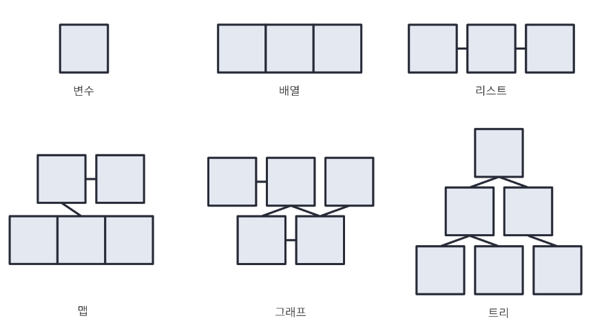

구조화된 데이터 - 자료구조

- 논리적 절차 - 알고리즘

- 선형 자료구조 

  - 한줄로 표현 가능 

  - 배열, 리스트

- 비선형 자료구조

  - 한줄로 표현 불가능

  - 맵, 그래프, 트리

## 타입

- Primitive 외는 다 Reference 타입(=Object)

### Primitive

- 메모리 어딘가에 저장됨

### Reference

- 실제 값이 들어있는 것이 아니라 메모리 상의 어딘가를 지칭(주소를 갖고 있음)
- 메소드에서 값을 변경하면 해당 값이 변경되는 것

## 시간 복잡도

- 입력되는 데이터의 증가에 따른 성능의 변화를 예측
- Big O 표기법 → O(n)

### O(1)

- n과 같이 수행

### O(n)

- 반복문은 n번 만큼 돌기때문에 O의 n
- n의 비례해서 증가하는 경우 

### O(n^2)

- 이중 반복문
- n이 증가할 수록 제곱만큼 증가하는 경우

### O(logn)

- 동작을 하면 할 수록 n이 절반씩 줄어나가는 경우

