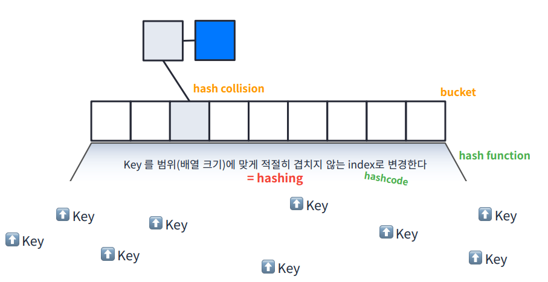

# 🖥️ Map

## 나오게 된 배경

- Array

  - 인덱스로 빠르게 읽기는 좋은데 유연하지 못한다.

- List

  - 유연하기는 한데 인덱스로 빠르게 읽기는 못한다.	

​	⇒ 두 가지를 합칠 수 없을까? 유연하면서도 빠르게 값을 찾아낼 수 있는!


## 설명

- Key 라는 값을 hash function 을 통해 hash 만들어서 버킷(Array)의 index로 사용해 Data 저장
- 같은 키에 대해 동일 해시값이 나오고 버킷 인덱스가 같은 값 발생 = 충돌
- 충돌을 해결하기 위해 List 를 구성하고 Data 저장

Key를 Array(bucket)에 매핑

 

- Key와 Value를 갖고 있고 테이블에 매핑함
- 맵 혹은 딕셔너리

| Key  | Vaue   |
| ---- | ------ |
| key1 | value1 |
| key2 | value2 |
| ...  | ...    |

### 시간 복잡도 O(1)


## 예제

### Hashtable

- Dictionary 상속

```java
package MapExam;

import java.util.Hashtable;

public class Main {
	public static void main(String[] args) {
		Hashtable<String, Integer> map = new Hashtable<>();
		map.put("A", 1);
		map.put("B", 2); // 값 있어도 덮어 씀
		map.replace("A", 10); // 값 있어도 덮어씀
		map.replace("A", 1, 10); // A가 1이라면 10으로 바꿈
		map.putIfAbsent("C", 10); // 값 없을때만 10이 들어감
		map.remove("B", 3); // B가 3이면 제거 - 출력 값 boolean

		System.out.println(map);
		System.out.println(map.get("A")); // 없는 값 출력시 null
		System.out.println(map.getOrDefault("C", -1)); // 없으면 뒤 값 출력
		System.out.println(map.values()); // 값만 출력
		System.out.println(map.keySet()); // 키만 출력
	}
}

```


###  interface Map<K, V>

```java
package MapExam;

import java.util.HashMap;
import java.util.Map;

public class Main {
	public static void main(String[] args) {
		Map<String, Integer> map = new HashMap<>();
		map.put("A", 1);
		map.put("B", 2); // 값 있어도 덮어 씀
		map.replace("A", 10); // 값 있어도 덮어씀
		map.replace("A", 1, 10); // A가 1이라면 10으로 바꿈
		map.putIfAbsent("C", 10); // 값 없을때만 10이 들어감
		map.remove("B", 3); // B가 3이면 제거 - 출력 값 boolean
		
		method1(map);
	}
	public static void method1(Map<String, Integer> map) {
		System.out.println(map);
		System.out.println(map.get("A")); // 없는 값 출력시 null
		System.out.println(map.getOrDefault("C", -1)); // 없으면 뒤 값 출력
		System.out.println(map.values()); // 값만 출력
		System.out.println(map.keySet()); // 키만 출력
	}
}

```

### HashMap

- not synch

### Hashtable

- synch 

###  ConcurrentHashMap

- synch + high concurrency

# ✏️ 문제풀기

## 1. 폰켓몬

###### 문제 설명

당신은 폰켓몬을 잡기 위한 오랜 여행 끝에, 홍 박사님의 연구실에 도착했습니다. 홍 박사님은 당신에게 자신의 연구실에 있는 총 N 마리의 폰켓몬 중에서 N/2마리를 가져가도 좋다고 했습니다.
홍 박사님 연구실의 폰켓몬은 종류에 따라 번호를 붙여 구분합니다. 따라서 같은 종류의 폰켓몬은 같은 번호를 가지고 있습니다. 예를 들어 연구실에 총 4마리의 폰켓몬이 있고, 각 폰켓몬의 종류 번호가 [3번, 1번, 2번, 3번]이라면 이는 3번 폰켓몬 두 마리, 1번 폰켓몬 한 마리, 2번 폰켓몬 한 마리가 있음을 나타냅니다. 이때, 4마리의 폰켓몬 중 2마리를 고르는 방법은 다음과 같이 6가지가 있습니다.

1. 첫 번째(3번), 두 번째(1번) 폰켓몬을 선택
2. 첫 번째(3번), 세 번째(2번) 폰켓몬을 선택
3. 첫 번째(3번), 네 번째(3번) 폰켓몬을 선택
4. 두 번째(1번), 세 번째(2번) 폰켓몬을 선택
5. 두 번째(1번), 네 번째(3번) 폰켓몬을 선택
6. 세 번째(2번), 네 번째(3번) 폰켓몬을 선택

이때, 첫 번째(3번) 폰켓몬과 네 번째(3번) 폰켓몬을 선택하는 방법은 한 종류(3번 폰켓몬 두 마리)의 폰켓몬만 가질 수 있지만, 다른 방법들은 모두 두 종류의 폰켓몬을 가질 수 있습니다. 따라서 위 예시에서 가질 수 있는 폰켓몬 종류 수의 최댓값은 2가 됩니다.
당신은 최대한 다양한 종류의 폰켓몬을 가지길 원하기 때문에, 최대한 많은 종류의 폰켓몬을 포함해서 N/2마리를 선택하려 합니다. N마리 폰켓몬의 종류 번호가 담긴 배열 nums가 매개변수로 주어질 때, N/2마리의 폰켓몬을 선택하는 방법 중, 가장 많은 종류의 폰켓몬을 선택하는 방법을 찾아, 그때의 폰켓몬 종류 번호의 개수를 return 하도록 solution 함수를 완성해주세요.

##### 제한사항

- nums는 폰켓몬의 종류 번호가 담긴 1차원 배열입니다.
- nums의 길이(N)는 1 이상 10,000 이하의 자연수이며, 항상 짝수로 주어집니다.
- 폰켓몬의 종류 번호는 1 이상 200,000 이하의 자연수로 나타냅니다.
- 가장 많은 종류의 폰켓몬을 선택하는 방법이 여러 가지인 경우에도, 선택할 수 있는 폰켓몬 종류 개수의 최댓값 하나만 return 하면 됩니다.

------

##### 입출력 예

| nums          | result |
| ------------- | ------ |
| [3,1,2,3]     | 2      |
| [3,3,3,2,2,4] | 3      |
| [3,3,3,2,2,2] | 2      |

##### 입출력 예 설명

입출력 예 #1
문제의 예시와 같습니다.

입출력 예 #2
6마리의 폰켓몬이 있으므로, 3마리의 폰켓몬을 골라야 합니다.
가장 많은 종류의 폰켓몬을 고르기 위해서는 3번 폰켓몬 한 마리, 2번 폰켓몬 한 마리, 4번 폰켓몬 한 마리를 고르면 되며, 따라서 3을 return 합니다.

입출력 예 #3
6마리의 폰켓몬이 있으므로, 3마리의 폰켓몬을 골라야 합니다.
가장 많은 종류의 폰켓몬을 고르기 위해서는 3번 폰켓몬 한 마리와 2번 폰켓몬 두 마리를 고르거나, 혹은 3번 폰켓몬 두 마리와 2번 폰켓몬 한 마리를 고르면 됩니다. 따라서 최대 고를 수 있는 폰켓몬 종류의 수는 2입니다.


###  내 풀이

```java
import java.util.HashSet;

class Solution {
    public int solution(int[] nums) {
		int pickNum = nums.length / 2;
		
		HashSet<Integer> set = new HashSet<>();
		for(int i=0; i<nums.length; i++) {
			set.add(nums[i]);
		}
		if(pickNum >= set.size()) return set.size();
		else return pickNum;
    }
}
```

### 다른  풀이

````java
// [3,3,3,2,2,2]
// [3,2] : 2개
// N/2 : 3개 
// 최소값을 선택한다.

import java.util.HashSet;

class Solution {
    public int solution(int[] nums) {
        // 포켓몬의 종류의 개수를 구한다.
        Map<Integer, Integer> map = new HashMap<>();
        for(int n: nums) {
            map.put(n, 0);
        }
    	int n1 = map.keySet().size();
 
        // 배열 크기의 1/2 을 구한다.
        int n2 = nums.length / 2;
        
        // 최소값을 선택한다.
        return Math.min(n1, n2);
    }
}
````

```java
import java.util.HashSet;

class Solution {
    public int solution(int[] nums) {
        List<Integer> list =new LinkedList<>();
        for(int n: nums) {
           	if(!list.contains(n)) list.add(n);
        }
        return Math.min(list.size(),  nums.length / 2);
    }
}
```


## 2. 완주하지 못한 선수

###### 문제 설명

수많은 마라톤 선수들이 마라톤에 참여하였습니다. 단 한 명의 선수를 제외하고는 모든 선수가 마라톤을 완주하였습니다.

마라톤에 참여한 선수들의 이름이 담긴 배열 participant와 완주한 선수들의 이름이 담긴 배열 completion이 주어질 때, 완주하지 못한 선수의 이름을 return 하도록 solution 함수를 작성해주세요.

##### 제한사항

- 마라톤 경기에 참여한 선수의 수는 1명 이상 100,000명 이하입니다.
- completion의 길이는 participant의 길이보다 1 작습니다.
- 참가자의 이름은 1개 이상 20개 이하의 알파벳 소문자로 이루어져 있습니다.
- 참가자 중에는 동명이인이 있을 수 있습니다.

##### 입출력 예

| participant                                       | completion                               | return   |
| ------------------------------------------------- | ---------------------------------------- | -------- |
| ["leo", "kiki", "eden"]                           | ["eden", "kiki"]                         | "leo"    |
| ["marina", "josipa", "nikola", "vinko", "filipa"] | ["josipa", "filipa", "marina", "nikola"] | "vinko"  |
| ["mislav", "stanko", "mislav", "ana"]             | ["stanko", "ana", "mislav"]              | "mislav" |

##### 입출력 예 설명

예제 #1
"leo"는 참여자 명단에는 있지만, 완주자 명단에는 없기 때문에 완주하지 못했습니다.

예제 #2
"vinko"는 참여자 명단에는 있지만, 완주자 명단에는 없기 때문에 완주하지 못했습니다.

예제 #3
"mislav"는 참여자 명단에는 두 명이 있지만, 완주자 명단에는 한 명밖에 없기 때문에 한명은 완주하지 못했습니다.


### 내 풀이

``` java
import java.util.HashMap;

class Solution {
    public String solution(String[] participant, String[] completion) {
        String answer = "";
        HashMap<String, Integer> map = new HashMap<>();
        
        for (String player : participant) {
            map.put(player, map.getOrDefault(player, 0) + 1);
        }
        for (String player : completion) {
            map.put(player, map.get(player) - 1);
        }
	    for (String key : map.keySet()) {
	        if (map.get(key) != 0){
	            answer = key;
	        }
	    }
        return answer;
    }
}
```

### 다른 풀이

``` java
import java.util.*;

class Solution {
    public String solution(String[] participant, String[] completion) {
        List<String> players = new LinkedList<>();
        
        for(String p: participant) players.add(p);
        for(String c: completion) players.remove(c); // <--- 이 부분 때문에 시간초과 => map 사용
        
        return players.get(0);
    }
}
```

``` java
import java.util.*;

class Solution {
    public String solution(String[] participant, String[] completion) {
        // O(n)
        Map<String, Integer> players = new HashMap<>();
        
        for(String p: participant) {
            players.put(p, players.getOrDefault(p, 0) + 1);
        }
     	for(String c: completion) {
            int n = players.get(c) - 1;
            if(n == 0) players.remove(c);
            else players.put(c, n);
        }
        return players.KeySet().iterator().next();
    }
}
```

```java
import java.util.*;

class Solution {
    public String solution(String[] participant, String[] completion) {
        // O(nlogn)
        Arrays.sort(participant); // O(nlogn)
        Arrays.sort(completion); // O(nlogn)
   
        // O(n)
        for(int i=0; i<completion.length; i++) {
            if(!participant[i].equals(completion[i])) return participant[i];
        }
        return participant[participant.length-1];
    }
}
```


## 3. 위장

###### 문제 설명

코니는 매일 다른 옷을 조합하여 입는것을 좋아합니다.

예를 들어 코니가 가진 옷이 아래와 같고, 오늘 코니가 동그란 안경, 긴 코트, 파란색 티셔츠를 입었다면 다음날은 청바지를 추가로 입거나 동그란 안경 대신 검정 선글라스를 착용하거나 해야합니다.

| 종류 | 이름                       |
| ---- | -------------------------- |
| 얼굴 | 동그란 안경, 검정 선글라스 |
| 상의 | 파란색 티셔츠              |
| 하의 | 청바지                     |
| 겉옷 | 긴 코트                    |

- 코니는 각 종류별로 최대 1가지 의상만 착용할 수 있습니다. 예를 들어 위 예시의 경우 동그란 안경과 검정 선글라스를 동시에 착용할 수는 없습니다.
- 착용한 의상의 일부가 겹치더라도, 다른 의상이 겹치지 않거나, 혹은 의상을 추가로 더 착용한 경우에는 서로 다른 방법으로 옷을 착용한 것으로 계산합니다.
- 코니는 하루에 최소 한 개의 의상은 입습니다.

코니가 가진 의상들이 담긴 2차원 배열 clothes가 주어질 때 서로 다른 옷의 조합의 수를 return 하도록 solution 함수를 작성해주세요.

------

##### 제한사항

- clothes의 각 행은 [의상의 이름, 의상의 종류]로 이루어져 있습니다.
- 코니가 가진 의상의 수는 1개 이상 30개 이하입니다.
- 같은 이름을 가진 의상은 존재하지 않습니다.
- clothes의 모든 원소는 문자열로 이루어져 있습니다.
- 모든 문자열의 길이는 1 이상 20 이하인 자연수이고 알파벳 소문자 또는 '_' 로만 이루어져 있습니다.

##### 입출력 예

| clothes                                                      | return |
| ------------------------------------------------------------ | ------ |
| [["yellow_hat", "headgear"], ["blue_sunglasses", "eyewear"], ["green_turban", "headgear"]] | 5      |
| [["crow_mask", "face"], ["blue_sunglasses", "face"], ["smoky_makeup", "face"]] | 3      |

##### 입출력 예 설명

예제 #1
headgear에 해당하는 의상이 yellow_hat, green_turban이고 eyewear에 해당하는 의상이 blue_sunglasses이므로 아래와 같이 5개의 조합이 가능합니다.

```
1. yellow_hat
2. blue_sunglasses
3. green_turban
4. yellow_hat + blue_sunglasses
5. green_turban + blue_sunglasses
```

예제 #2
face에 해당하는 의상이 crow_mask, blue_sunglasses, smoky_makeup이므로 아래와 같이 3개의 조합이 가능합니다.

```
1. crow_mask
2. blue_sunglasses
3. smoky_makeup
```


### 내 풀이

``` java
import java.util.HashMap;
import java.util.Iterator;

class Solution {
    public int solution(String[][] clothes) {
        HashMap<String, Integer> map = new HashMap<>();
        for (String[] clothe : clothes) {
            String type = clothe[1];
            map.put(type, map.getOrDefault(type, 0) + 1);
        }

        Iterator<Integer> it = map.values().iterator();
        int answer = 1;
        
        while(it.hasNext())
            answer *= it.next().intValue() + 1;

        return answer - 1;
    }
}
```

### 다른 풀이

``` java
import java.util.HashMap;
import java.util.Iterator;

class Solution {
    public int solution(String[][] clothes) {
        // headgear : 2 -> 3
        // eyewear : 1 -> 2
        // 3 * 2 == 6 - 1 = 5
        
        HashMap<String, Integer> map = new HashMap<>();
        // 위장 용품의 종류별 개수를 구한다.
        for(String [] c : clothes) {
            String type = c[1];
            map.put(type, map.getOrDefault(type, 0) + 1);
        }
        
        // 각 개수의 +1 을  모두 곱한다.
        int answer = 1;
        var iter = map.values().iterator();
        while(iter.hasNext()) {
            answer *= iter.next() + 1;
        }
        
        // -1 해서 리턴한다. - 모든 것을 착용안하는 경우의 수는 빼줘야함 주의!
     	return answer - 1;
    }
}
```

