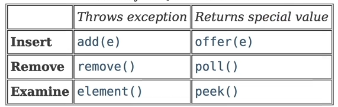
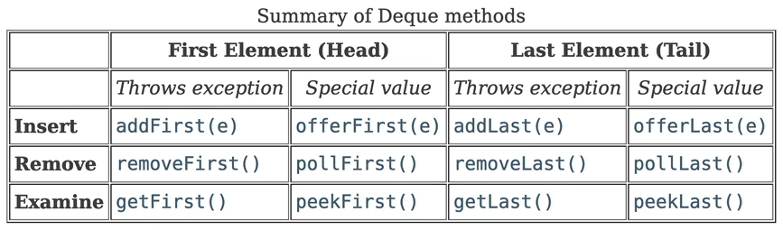

#  🖥️ Stack/Queue

## 규칙

- 어디서 값을 꺼낼 것인가?
  1. 앞에서 부터 꺼내기 - Queue
  2. 뒤에서 부터 꺼내기 - Stack
  3. 앞 혹은 뒤 양방향 - Deque
- 중간 데이터 꺼낼 때는 X

### Stack

- LIFO(Last In First Out)

### Queue

- FIFO(First In First Out)

 

### Deque

- 양방향 가능

 


## 예제

``` java
package StackQueueExam;

import java.util.Deque;
import java.util.LinkedList;
import java.util.List;
import java.util.Queue;
import java.util.Stack;

/*
 * Queue: offer, poll, peek : 들어간 순서대로
 * Stack: push,  pop,  peek : 들어간 반대로
 * Deque: offerFirst, offerLast : 양방향
 */
public class Main {
	public static void main(String[] args) {

		// list로 구현
		List<Integer> list = new LinkedList<>();
		list.add(1);
		list.add(2);
		list.add(3);
		System.out.println(list);
		System.out.println(list.remove(0)); // Queue의 꺼내기
		System.out.println(list.remove(list.size() - 1)); // Stack의 꺼내기
		System.out.println(list);

		// Interface Queue
		Queue<Integer> queue = new LinkedList<>();

		queue.offer(1);
		queue.offer(2);
		queue.offer(3);
		System.out.println(queue);
		System.out.println(queue.poll());
		System.out.println(queue.peek()); // 꺼내지않고 확인만 하는 것

		// Class Stack
		Stack<Integer> stack = new Stack<>();

		stack.push(1);
		stack.push(2);
		stack.push(3);
		System.out.println(stack);
		System.out.println(stack.pop());
		System.out.println(stack.peek());
		
		// Interface Deque
		Deque<Integer> deque = new LinkedList<>();
		deque.offerFirst(1);
		deque.offerLast(2);
		deque.offerFirst(3);
		deque.offerLast(4);
		System.out.println(deque); // 3, 1, 2, 4
		System.out.println(deque.pollFirst()); // 3
		System.out.println(deque.pollLast()); // 4
	}
}
```


#  ✏️문제 풀기

## 올바른 괄호

###### 문제 설명

괄호가 바르게 짝지어졌다는 것은 '(' 문자로 열렸으면 반드시 짝지어서 ')' 문자로 닫혀야 한다는 뜻입니다. 예를 들어

- "()()" 또는 "(())()" 는 올바른 괄호입니다.
- ")()(" 또는 "(()(" 는 올바르지 않은 괄호입니다.

'(' 또는 ')' 로만 이루어진 문자열 s가 주어졌을 때, 문자열 s가 올바른 괄호이면 true를 return 하고, 올바르지 않은 괄호이면 false를 return 하는 solution 함수를 완성해 주세요.

##### 제한사항

- 문자열 s의 길이 : 100,000 이하의 자연수
- 문자열 s는 '(' 또는 ')' 로만 이루어져 있습니다.

------

##### 입출력 예

| s        | answer |
| -------- | ------ |
| "()()"   | true   |
| "(())()" | true   |
| ")()("   | false  |
| "(()("   | false  |

##### 입출력 예 설명

입출력 예 #1,2,3,4
문제의 예시와 같습니다.


### 내 풀이

``` java
import java.util.Stack;

class Solution {
    boolean solution(String s) {
        Stack<Character> stack = new Stack<>();
        
        for(int i=0; i<s.length(); i++){
            char ch = s.charAt(i);
            
            if(ch=='(') stack.push(ch);
            else if(ch==')') {
                if (stack.isEmpty()) return false;  
                stack.pop();
            }
        }
        return stack.isEmpty();
    }
}
```

### 다른 풀이

```java
import java.util.Stack;

class Solution {
    boolean solution(String s) {
        int stack = 0;
       	for(char c: s.toCharArray()) {
            if(c=='(') stack++;
            else {
                if(stack == 0) return false;
                stack--;
            }
        }
        return stack == 0;
    }
}
```


## 기능 개발

###### 문제 설명

프로그래머스 팀에서는 기능 개선 작업을 수행 중입니다. 각 기능은 진도가 100%일 때 서비스에 반영할 수 있습니다.

또, 각 기능의 개발속도는 모두 다르기 때문에 뒤에 있는 기능이 앞에 있는 기능보다 먼저 개발될 수 있고, 이때 뒤에 있는 기능은 앞에 있는 기능이 배포될 때 함께 배포됩니다.

먼저 배포되어야 하는 순서대로 작업의 진도가 적힌 정수 배열 progresses와 각 작업의 개발 속도가 적힌 정수 배열 speeds가 주어질 때 각 배포마다 몇 개의 기능이 배포되는지를 return 하도록 solution 함수를 완성하세요.

##### 제한 사항

- 작업의 개수(progresses, speeds배열의 길이)는 100개 이하입니다.
- 작업 진도는 100 미만의 자연수입니다.
- 작업 속도는 100 이하의 자연수입니다.
- 배포는 하루에 한 번만 할 수 있으며, 하루의 끝에 이루어진다고 가정합니다. 예를 들어 진도율이 95%인 작업의 개발 속도가 하루에 4%라면 배포는 2일 뒤에 이루어집니다.

##### 입출력 예

| progresses               | speeds             | return    |
| ------------------------ | ------------------ | --------- |
| [93, 30, 55]             | [1, 30, 5]         | [2, 1]    |
| [95, 90, 99, 99, 80, 99] | [1, 1, 1, 1, 1, 1] | [1, 3, 2] |

##### 입출력 예 설명

입출력 예 #1
첫 번째 기능은 93% 완료되어 있고 하루에 1%씩 작업이 가능하므로 7일간 작업 후 배포가 가능합니다.
두 번째 기능은 30%가 완료되어 있고 하루에 30%씩 작업이 가능하므로 3일간 작업 후 배포가 가능합니다. 하지만 이전 첫 번째 기능이 아직 완성된 상태가 아니기 때문에 첫 번째 기능이 배포되는 7일째 배포됩니다.
세 번째 기능은 55%가 완료되어 있고 하루에 5%씩 작업이 가능하므로 9일간 작업 후 배포가 가능합니다.

따라서 7일째에 2개의 기능, 9일째에 1개의 기능이 배포됩니다.

입출력 예 #2
모든 기능이 하루에 1%씩 작업이 가능하므로, 작업이 끝나기까지 남은 일수는 각각 5일, 10일, 1일, 1일, 20일, 1일입니다. 어떤 기능이 먼저 완성되었더라도 앞에 있는 모든 기능이 완성되지 않으면 배포가 불가능합니다.

따라서 5일째에 1개의 기능, 10일째에 3개의 기능, 20일째에 2개의 기능이 배포됩니다.

### 내 풀이

``` java
import java.util.*;

class Solution {
    public int[] solution(int[] progresses, int[] speeds) {
        Queue<Integer> queue = new LinkedList<>();
		ArrayList<Integer> list = new ArrayList<>();
		
        for(int i=0; i<progresses.length; i++){
            int n1 = 100 - progresses[i];
            int n2 = n1 / speeds[i];
            if(n1 % speeds[i] != 0) n2++;
            
            queue.add(n2);
        }

        int cnt = 0;
        int top = queue.peek();
        while (!queue.isEmpty()) {
            if (queue.peek() <= top) {
                queue.remove();
                cnt++;
            } else {
                list.add(cnt);
                cnt = 0;
                top = queue.peek();
            }
        }
        list.add(cnt);
        
        return list.stream().mapToInt(Integer::intValue).toArray();
    }
}
```

### 다른 풀이

```java
import java.util.*;

class Solution {
    public int[] solution(int[] progresses, int[] speeds) {
        Queue<Integer> queue = new LinkedList<>();
        for(int i=0; i<progresses.length; i++){
            float p = progresses[i];
            float s = speeds[i];
            int days = (int)Math.ceil((100 - p) / s);
            queue.offer(days);
        }
        
        Queue<Integer> answer = new LinkedList<>();
        ind d = queue.poll();
        int count = 1;
        while (!queue.isEmpty()) {
           	int n = queue.poll();
            
            if(d >= n) {
                count++;
                continue;
            }
            
            answer.offer(count);
            count = 1;
            d = n;
        }
        answer.add(count);
        
        return answer.stream().mapToInt(Integer::intValue).toArray();
    }
}
```

